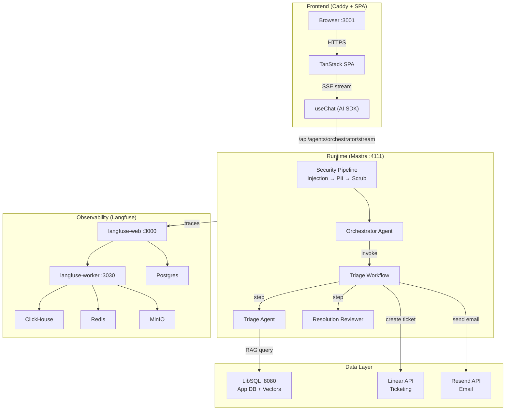

# AGENTS_USE.md — How We Use AI Agents in Triage

> Current branch status (2026-04-08): this repository currently contains the infrastructure, test, and integration-tooling foundation for the hackathon build. The executable agent runtime, frontend chat app, and webhook-driven resolution loop described below are target architecture and are not all committed on this branch yet.

## Current Branch Scope

Implemented on this branch:

- 9-container Docker Compose stack with `app` and `langfuse` network separation
- stub frontend and runtime containers for clean-clone startup
- 5 Linear Mastra tools and 2 Resend Mastra tools
- shared Zod schemas and env/config handling
- runtime unit tests plus infrastructure validation tests

Still pending for the full hackathon deliverable:

- frontend chat experience
- durable workflow entrypoint and agent orchestration
- RAG/wiki pipeline wiring
- webhook-driven resolution verification loop
- final observability screenshots and demo evidence

# Agent #1 — Orchestrator

## 1. Agent Overview

**Agent Name:** Orchestrator Agent
**Purpose:** The Orchestrator is the primary user-facing agent. It receives incident reports through a chat interface (text + images/logs), detects whether the input is a single or batch incident, and routes it through the triage workflow. It acts as the conversational layer between users and the automated triage pipeline, managing context flow and surfacing structured results via generative UI components.
**Tech Stack:** TypeScript, Mastra v1.23, AI SDK, OpenRouter (Qwen 3.6 Plus multimodal / Mercury), LibSQL, Langfuse

---

## 2. Target Agents & Capabilities

### Agent: Orchestrator

| Field | Description |
|-------|-------------|
| **Implementation Status** | Planned. This branch does not yet include the committed frontend chat app or workflow runtime that executes this agent. |
| **Role** | User-facing conversational agent. Receives incident reports, detects batch vs single incidents, invokes the triage workflow, and streams structured results back to the user. |
| **Type** | Semi-autonomous — human-in-the-loop for ticket creation approval |
| **LLM** | OpenRouter (Qwen 3.6 Plus multimodal for default, Mercury for demo) |
| **Inputs** | Text descriptions, images (screenshots, diagrams), log files (.log, .txt), clipboard pastes |
| **Outputs** | Structured triage cards (severity, root cause, file references), ticket creation prompts, resolution notifications |
| **Tools** | `triageWorkflow` (Mastra workflow tool), chat streaming via AI SDK SSE protocol |

### Agent: Triage Agent

| Field | Description |
|-------|-------------|
| **Implementation Status** | Planned. The repo currently contains the Linear/Resend tool layer this agent will call, but not the committed RAG or workflow wiring. |
| **Role** | Core intelligence agent. Analyzes incidents against the codebase knowledge base (wiki), identifies root cause down to specific files/functions, scores severity and confidence, and produces a structured triage output. |
| **Type** | Autonomous — runs as a step within the triage workflow |
| **LLM** | OpenRouter (same model as Orchestrator) |
| **Inputs** | Incident description (text + attachments), codebase wiki context (RAG results) |
| **Outputs** | `TriageOutput` — severity, priority, root cause analysis, affected files, proposed fix, confidence score, suggested assignee |
| **Tools** | `queryWiki` (RAG via LibSQLVector), `listIssues` (deduplication check) |

### Agent: Resolution Reviewer

| Field | Description |
|-------|-------------|
| **Implementation Status** | Planned. Resolution webhook handling and workflow resume logic are not committed on this branch yet. |
| **Role** | Verifies that resolved tickets have actual code changes (PRs/commits) that address the original issue. Prevents false resolutions where tickets are marked "done" without evidence of a fix. |
| **Type** | Autonomous — triggered by Linear webhook when ticket status changes to "Done" |
| **LLM** | OpenRouter (same model) |
| **Inputs** | Original triage output, linked PR/commit data from Linear |
| **Outputs** | Verification result: confirmed fix / insufficient evidence / needs review |
| **Tools** | Linear tools (getIssue, PR data), `sendResolutionEmail` (Resend) |

---

## 3. Target Architecture & Orchestration

- **Architecture diagram (target):**

- **Current implemented foundation:** Docker Compose infrastructure, Langfuse services, stub frontend/runtime containers, and the Linear/Resend tool layer are committed now.

- **Orchestration approach (target):** Sequential pipeline orchestrated by Mastra durable workflows. The Orchestrator agent invokes the `triageWorkflow` as a tool. The workflow progresses through ordered steps: intake → triage → dedup → approval gate (suspend) → ticket creation → notification → suspend for resolution → verify → notify reporter.

- **State management (target):** Mastra workflows persist state to LibSQL. Workflow state survives container restarts. Suspend/resume pattern enables the workflow to pause waiting for user approval (ticket creation) or external events (Linear webhook for resolution). Chat state is planned to be managed by AI SDK `useChat` on the frontend.

- **Error handling:** Implemented today: tool-level error boundaries, shared Zod schemas, sanitized Linear/Resend logging, graceful degradation when API keys are missing, and approval gating on ticket creation. Planned in the workflow layer: step retries, suspend/resume handling, and local ticket fallback orchestration.

- **Handoff logic (target):** Orchestrator → triageWorkflow (tool invocation) → Triage Agent (workflow step) → Resolution Reviewer (webhook-triggered workflow resume). Each handoff passes typed data validated by Zod schemas.

---

## 4. Context Engineering

> The context model below is the intended design for the full hackathon deliverable. The current branch does not yet contain the committed RAG/wiki runtime wiring.

- **Context sources:**
  - User input: text descriptions, images (screenshots, UI mockups), log files
  - Codebase knowledge base: pre-generated llm-wiki stored as vector embeddings in LibSQL
  - Linear ticket history: existing issues queried for deduplication
  - Incident metadata: timestamps, reporter identity, project context

- **Context strategy:** Two-pass llm-wiki approach:
  1. **Pass 1 (per-file):** Each file in the connected codebase (Solidus, a Ruby on Rails e-commerce platform) is summarized individually — purpose, key functions, dependencies
  2. **Pass 2 (synthesis):** Cross-module analysis identifies architectural patterns, data flows, and component relationships
  3. **Storage:** Summaries chunked and embedded using `text-embedding-3-small` (1536 dimensions), stored as `F32_BLOB` in LibSQL with DiskANN indexing
  4. **Retrieval:** RAG via `vector_top_k('wiki_chunks_idx', queryEmbedding, 10)` returns the 10 most relevant code context chunks for each incident

- **Token management:** Context window managed through chunk-level retrieval (not full documents). RAG returns only the most relevant 10 chunks. Images resized client-side via Canvas API before upload. File size limits enforced: 10MB/file, 25MB/message.

- **Grounding:** All triage outputs are grounded in actual codebase data via RAG. Confidence scoring flags low-certainty results (below threshold). Structured output via Zod schemas prevents hallucinated fields. File references in triage output point to real files in the wiki.

---

## 5. Target Use Cases

### Use Case 1: Single Incident Triage

- **Trigger:** User describes an incident in the chat interface (e.g., "The checkout page is showing a 500 error when users try to apply discount codes") and optionally attaches a screenshot
- **Steps:**
  1. Frontend sends message + attachments via AI SDK SSE to Orchestrator
  2. Security pipeline validates input (prompt injection check, PII redaction)
  3. Orchestrator detects single incident, invokes triage workflow
  4. Triage Agent queries wiki for relevant codebase context (RAG)
  5. Triage Agent produces structured `TriageOutput` with severity, root cause, affected files, proposed fix
  6. Workflow checks for duplicate tickets in Linear
  7. Triage card rendered in chat UI with "Create Ticket" approval button
  8. User approves → Linear ticket created with full triage details
  9. Email notification sent to assigned engineer
  10. Workflow suspends, waiting for resolution
- **Expected outcome:** Fully triaged ticket created in Linear within 60 seconds, assigned to the correct engineer, with root cause analysis citing specific files

### Use Case 2: Resolution Verification

- **Trigger:** Engineer marks Linear ticket as "Done" → Linear fires webhook
- **Steps:**
  1. Webhook arrives at `/api/webhooks/linear` via Cloudflare Tunnel
  2. Workflow resumes from suspend state
  3. Resolution Reviewer agent checks linked PRs/commits against original triage
  4. Reviewer verifies code changes address the identified root cause
  5. If verified: resolution email sent to original reporter
  6. If insufficient: ticket reopened with review notes
- **Expected outcome:** Reporter receives notification confirming fix shipped, with evidence. False resolutions caught before reporter is notified.

### Use Case 3: Batch Incident Detection

- **Trigger:** User describes multiple issues in a single message
- **Steps:**
  1. Orchestrator detects batch pattern (multiple distinct issues)
  2. Each incident processed through its own triage workflow instance
  3. Results rendered as separate triage cards in chat
- **Expected outcome:** All incidents triaged independently with separate tickets

---

## 6. Observability

- **Logging:** Implemented today: structured console output from the stub runtime and sanitized error logging inside the Linear and Resend tools. Secrets are expected to stay in environment variables and are not required by the test suite.

- **Tracing:** Implemented today: Langfuse infrastructure is part of the Docker Compose stack and is health-checked by the infrastructure test suite. Target behavior: once the runtime workflow layer is committed, agent calls and workflow steps will emit end-to-end traces into Langfuse.

- **Metrics:**
  - Implemented today: service health, compose/config validation, image-size checks, and environment/config assertions
  - Target once runtime lands: time-to-first-token, total triage time, per-step durations, token usage, and ticket/email success rates

- **Dashboards:** Langfuse web dashboard at `http://localhost:3000` is available in the Docker stack today. It is ready to receive real workflow traces once the runtime entrypoint is added.

### Evidence

<!-- EVIDENCE: Add Langfuse screenshots, trace IDs, and demo captures from a real end-to-end triage run once the workflow runtime is committed. -->

- Current automated evidence:
  - `tests/infra-docker/architecture-alignment.test.ts` validates the Langfuse-related services, network segmentation, and Caddy/runtime integration points.
  - `tests/infra-docker/docker-compose.test.ts` validates compose parsing and failure behavior for bad env setup.
  - `tests/infra-docker/dockerfiles.test.ts` enforces the image-size constraint for the hackathon stack.
- Remaining evidence to capture before final submission:
  - real Langfuse traces from an end-to-end triage run
  - screenshots for the demo and `AGENTS_USE.md`

---

## 7. Security & Guardrails

- **Implemented on this branch:**
  - Tool-level error boundaries with typed success/error responses validated by Zod schemas
  - `createLinearIssue` uses `requireApproval: true`, preserving a human approval gate for ticket creation
  - Linear and Resend error logs are sanitized to messages instead of dumping raw objects
  - Secrets stay in env vars, and `.env.example` documents placeholders instead of checked-in live values
  - Compose-level isolation separates app traffic from the Langfuse infrastructure network

- **Planned before final demo:**
  - prompt-injection filtering on user input
  - PII redaction before LLM context assembly
  - attachment-type and size validation in the real frontend/runtime path
  - auth/session handling for the real UI

### Evidence

<!-- EVIDENCE: Add screenshots or trace captures for the final prompt-injection, PII-redaction, browser header, and file-validation flows once the real UI/runtime exists. -->

- Current automated evidence:
  - `runtime/src/mastra/tools/linear.test.ts` verifies approval gating, singleton clients, and structured error handling.
  - `runtime/src/mastra/tools/resend.test.ts` verifies graceful degradation and idempotency-key usage.
  - `tests/infra-docker/env-config.test.ts` verifies the documented integration env vars and missing-key behavior.
- Remaining evidence to capture before final submission:
  - prompt-injection and PII-redaction proof once the real agent runtime exists
  - browser-visible header and file-validation screenshots from the final UI

---

## 8. Scalability

Triage is designed to scale from a single Docker Compose deployment to a production Kubernetes cluster. See [`SCALING.md`](./SCALING.md) for the full analysis.

- **Current capacity:** 9-container Docker Compose stack runs on a single machine. Suitable for development and small team usage (1-10 concurrent users). All images pull in <2GB total, and on this branch the frontend and runtime containers are stubs unless the full app code is added.

- **Scaling approach:**
  - **Horizontal:** Frontend (Caddy) and Runtime (Mastra) are stateless — scale with replicas behind a load balancer. Langfuse worker scales as queue consumers.
  - **Vertical:** LibSQL (single-writer), ClickHouse (analytical queries), Redis (in-memory cache) scale vertically.
  - **Kubernetes path:** Helm chart with 14 templates, HPAs for frontend/runtime (autoscaling/v2, 50% CPU target), LibSQL StatefulSet with PVC, Bitnami subcharts for Postgres, ClickHouse, Redis, MinIO.

- **Bottlenecks identified:**
  1. Runtime ↔ LLM latency (OpenRouter API calls are the primary bottleneck)
  2. LibSQL write throughput (single-writer architecture)
  3. ClickHouse ingestion (high trace volume)
  4. Network egress (LLM API calls)

---

## 9. Lessons Learned & Team Reflections

<!-- TODO: Fill after hackathon completion. Document:
  - What worked well: approaches, tools, or decisions that paid off
  - What you would do differently: with more time or resources
  - Key technical decisions: trade-offs made and why
-->

> **Status:** To be completed after the hackathon build sprint.

- **What worked well:**
  - SpecSafe TDD pipeline for infrastructure — 192 tests before any production code
  - Docker Compose with stub fallbacks — full 9-container stack runnable from Day 1
  - Network segmentation (app + langfuse) — clean separation of concerns
  - Planning-first approach (BMAD methodology) — architecture decisions locked before coding

- **What you would do differently:**
  <!-- TODO: Add retrospective items -->

- **Key technical decisions:**
  - Mastra as HTTP server (no Express) — eliminates a framework layer
  - Single-origin Caddy proxy — no CORS, session cookies work automatically
  - LibSQL for everything (app DB + vectors + workflow state) — one database to manage
  - Tool-level error boundaries — simple, consistent error handling pattern
  - Two-pass llm-wiki — per-file summaries then cross-module synthesis for deep codebase understanding

---
