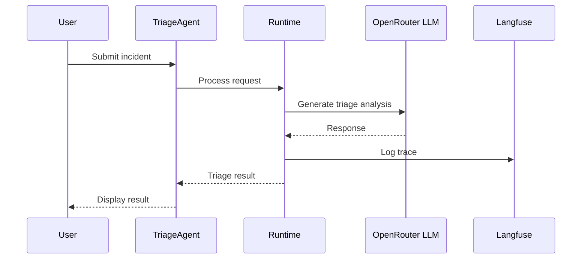

# AGENTS_USE — How We Use AI Agents in Triage

## 1. Agent Overview

TODO: High-level summary of how AI agents power the Triage system.

## 2. Agents & Capabilities

TODO: List each agent, its role, tools, and capabilities.

## 3. Architecture & Orchestration

TODO: Describe the multi-agent architecture and how agents coordinate.

## 4. Context Engineering

TODO: Describe how context is gathered, compressed, and fed to agents.

## 5. Use Cases

TODO: Describe primary use cases and user journeys.

## 6. Observability

TODO: How we monitor agent behavior, trace quality, and detect regressions.

<!-- EVIDENCE: Add Langfuse trace screenshots and metrics dashboards here -->

## 7. Security & Guardrails

TODO: Describe prompt injection defenses, output validation, and guardrails.

<!-- EVIDENCE: Add security audit results and guardrail test outputs here -->

## 8. Scalability

TODO: How the agent system scales with load.

## 9. Lessons Learned

TODO: Key takeaways from building with AI agents.
