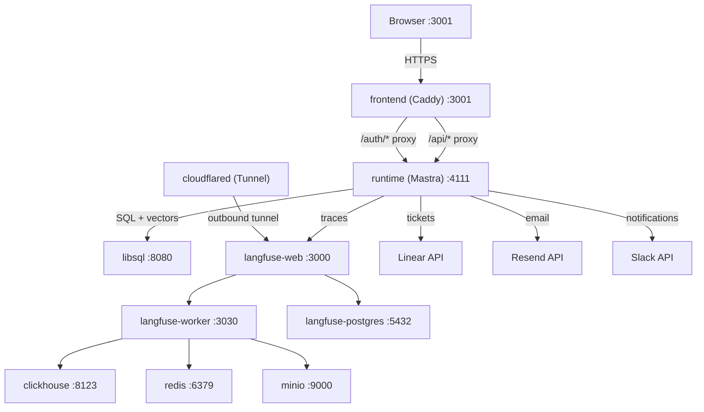

# Triage — AI-Powered SRE Incident Triage Agent

AI agent that triages SRE incidents for Solidus/Rails e-commerce: describe the incident, get a root-cause analysis, a Linear ticket, and email + Slack notifications — all in one chat session.

[Demo Video (YouTube)](https://youtube.com/watch?v=TODO) #AgentXHackathon

## What Is Triage?

Triage is an AI-powered incident triage system for on-call SRE engineers working on Solidus/Rails e-commerce platforms. Instead of manually hunting through logs, codebase history, and runbooks under pressure, an engineer describes the incident in plain text (with optional screenshots), and Triage does the rest.

The agent queries a codebase knowledge base via vector search (Wiki/RAG pipeline), identifies the root cause with specific file references, scores severity and confidence, and produces a structured triage report. The engineer reviews a TriageCard preview, approves it, and the agent creates a Linear ticket, sends email and Slack notifications to the team, and then suspends — waiting for a webhook when the fix ships. When it does, the Resolution Reviewer agent confirms whether the issue is actually resolved and notifies the reporter.

Teams can connect any Git repository through the **Projects UI** — the system clones, chunks, embeds, and indexes the codebase into the Wiki/RAG vector store, making the Triage Agent immediately effective against that codebase.

The full system runs on a single `docker compose up --build` from a clean clone. Ten containers start behind a Caddy reverse proxy that eliminates CORS and handles all security headers. Observability is provided by a self-hosted Langfuse stack with LLM traces, token cost tracking, and latency metrics — exposed externally via a Cloudflare Tunnel at `https://langfuse.agenticengineering.lat`.

## Architecture




- **10 containers** on 2 Docker networks (`app` + `langfuse`), all with healthchecks and `depends_on: service_healthy`
- **Single-origin Caddy reverse proxy** — serves the SPA and proxies `/api/*` and `/auth/*` to the runtime; no CORS required
- **Mastra durable workflow runtime** — agents, workflows, tools, and Better Auth session handling on a single Hono server
- **LibSQL with F32_BLOB(1536) vector search** — DiskANN index for codebase wiki RAG; also serves workflow state, auth, and fallback ticket storage

## Quick Start

```bash
# 1. Clone the repository
git clone https://github.com/Agentic-Engineering-Agency/triage.git
cd triage

# 2. Configure environment
cp .env.example .env
# Edit .env — fill in the four mandatory vars at minimum (see below)

# 3. Start all services
docker compose up --build
```

Open [http://localhost:3001](http://localhost:3001) for the chat UI.
Open [http://localhost:3000](http://localhost:3000) for the Langfuse observability dashboard.

**Mandatory environment variables:**

| Variable | Purpose |
|----------|---------|
| `OPENROUTER_API_KEY` | LLM access via OpenRouter |
| `LINEAR_API_KEY` | Linear ticket creation |
| `RESEND_API_KEY` | Email notifications |
| `BETTER_AUTH_SECRET` | Session signing (any 32+ char random string) |

**Recommended (for full notification support):**

| Variable | Purpose |
|----------|---------|
| `SLACK_BOT_TOKEN` | Slack notifications via Bot User OAuth Token |
| `SLACK_CHANNEL_ID` | Default Slack channel for incident alerts |

See [`.env.example`](./.env.example) for all 58 documented variables. See [`QUICKGUIDE.md`](./QUICKGUIDE.md) for detailed setup and troubleshooting.

## Tech Stack

| Layer | Technology | Purpose |
|-------|-----------|---------|
| Agent Framework | [Mastra](https://mastra.ai) v1.23 | Multi-agent orchestration, durable workflows, tool system |
| Database | [LibSQL](https://turso.tech/libsql) (sqld) | App data, vector embeddings (F32_BLOB + DiskANN), workflow state |
| ORM | [Drizzle](https://orm.drizzle.team) | Type-safe SQL, schema management, migrations |
| Auth | [Better Auth](https://www.better-auth.com) | Session-based auth with HttpOnly cookies |
| Observability | [Langfuse](https://langfuse.com) v3 | LLM traces, token cost tracking, latency metrics |
| LLM Gateway | [OpenRouter](https://openrouter.ai) | Multimodal LLM access with 3-model fallback routing |
| Frontend | [TanStack Router](https://tanstack.com/router) + [React](https://react.dev) | File-based SPA routing with lazy loading |
| AI UI | [AI SDK](https://sdk.vercel.ai) + [AI SDK Elements](https://sdk.vercel.ai/docs/ai-sdk-ui/chatbot-with-tool-use) | Chat streaming (SSE), generative UI components |
| Reverse Proxy | [Caddy](https://caddyserver.com) v2 | Single-origin architecture, security headers, SSE support |
| UI Components | [shadcn/ui](https://ui.shadcn.com) | Radix-based accessible component library |
| Ticketing | [Linear](https://linear.app) SDK | Issue creation, assignment, status tracking, webhooks |
| Email | [Resend](https://resend.com) | Transactional email notifications |
| Chat Notifications | [Slack](https://api.slack.com) Web API | Ticket and resolution notifications with Block Kit formatting |
| Wiki/RAG | [@mastra/rag](https://mastra.ai) + LibSQL vectors | Codebase cloning, chunking, embedding, and semantic search |

## Agents

| Agent | Model | Role |
|-------|-------|------|
| **Orchestrator** | MiniMax M2.7 (3-model fallback) | User-facing conversational agent; batch detection, workflow routing, streaming responses |
| **Triage Agent** | Mercury-2 | Core intelligence; codebase RAG, root cause analysis, severity scoring, file references |
| **Resolution Reviewer** | Mercury-2 | Fix verification; PR/commit analysis, resolution confirmation, reporter notification |
| **Code Review Agent** | Mercury-2 (chill/assertive profiles) | Code quality analysis integrated into the triage workflow |

## Documentation

| Document | Description |
|----------|-------------|
| [`AGENTS_USE.md`](./AGENTS_USE.md) | Agent implementation, architecture, observability, security |
| [`SCALING.md`](./SCALING.md) | Docker → Kubernetes migration path, cost projections |
| [`QUICKGUIDE.md`](./QUICKGUIDE.md) | Setup, verification, and troubleshooting |
| [`.env.example`](./.env.example) | 58 documented environment variables with placeholders and comments |
| [`docs/linear-resend-integration-assessment.md`](./docs/linear-resend-integration-assessment.md) | Design and implementation notes for the Linear and Resend tool layer |
| [Live deployment](https://triage.agenticengineering.lat) | Hosted demo instance |

## Team

| Name | Role | Focus |
|------|------|-------|
| **Lalo** | Lead & Agents | Workflow orchestration, agent design, Linear integration |
| **Fernando** | Infrastructure | Docker Compose, K8s scaffolding, CI/CD, SpecSafe pipeline |
| **Koki** | Runtime & Integrations | Mastra setup, wiki pipeline, security processors, Resend |
| **Chenko** | Frontend | TanStack SPA, chat UI, auth flow |

Built for the AgentX Hackathon 2026.

## License

[MIT](./LICENSE)
