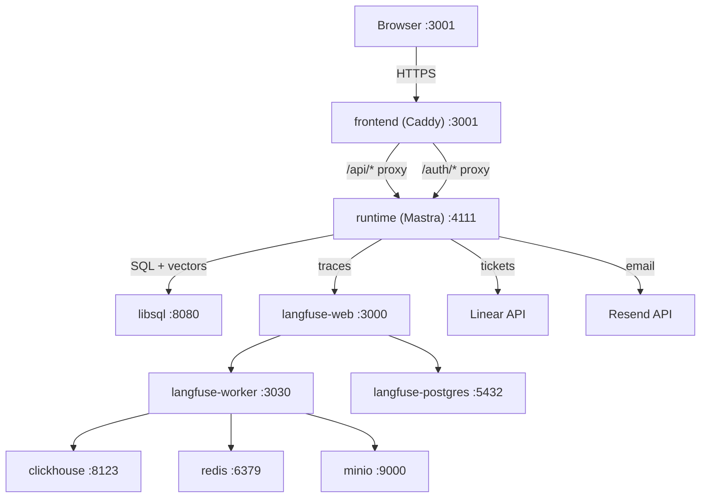

# Triage — AI-Powered SRE Incident Triage Agent

> Hackathon build foundation for an observable SRE incident triage system. This branch currently ships the Docker/Langfuse stack, stub app containers, Linear and Resend tool integrations, and automated tests for the integration layer.


## What Is Triage?

Triage is the hackathon project for an SRE incident intake and triage agent. The target system accepts incident reports, analyzes the connected e-commerce codebase, creates or updates a ticket in Linear, and notifies both engineers and reporters through the full resolution loop.

This branch is the implementation foundation for that system. The committed code currently includes:

- the 9-container Docker Compose stack with `app` and `langfuse` networks
- stub frontend and runtime fallbacks so `docker compose up --build` works from a clean clone
- 5 Linear Mastra tools and 2 Resend Mastra tools in `runtime/src/mastra/tools/`
- shared Zod contracts in `runtime/src/lib/schemas/ticket.ts`
- runtime unit tests and infrastructure validation tests

The full chat UI, durable workflow runtime, and resolution webhook path described in the target architecture are not all committed on this branch yet.

**Target E2E flow:** Submit → Triage → Ticket Created → Team Notified → Resolved → Reporter Notified

For agent implementation details, see [`AGENTS_USE.md`](./AGENTS_USE.md). For scaling strategy, see [`SCALING.md`](./SCALING.md). For setup instructions, see [`QUICKGUIDE.md`](./QUICKGUIDE.md).

## Current Status

Implemented now:

- Docker Compose stack with Caddy, LibSQL, Langfuse, and health checks
- Stub frontend and runtime containers for clean-clone startup
- Linear ticketing tools and Resend email tools
- Shared schemas, env/config handling, and sanitized tool error logging
- Automated test coverage for runtime integrations and Docker/infrastructure configuration

Still required before a full hackathon demo/submission:

- real frontend chat SPA
- runtime entrypoint and workflow orchestration
- webhook-driven resolution flow
- capture of final observability/security evidence and demo video

## Architecture



**Target topology:** 9 containers on 2 Docker networks (`app` + `langfuse`), all with healthchecks and `depends_on: service_healthy`.

**Current branch behavior:** if `frontend/` or `runtime/src/mastra/index.ts` are absent, Docker builds fall back to the stub containers in `stubs/`. That keeps the infrastructure runnable while the full app is still being wired.

## Quick Start

```bash
# 1. Clone the repository
git clone https://github.com/Agentic-Engineering-Agency/triage.git
cd triage

# 2. Configure environment
cp .env.example .env
# Edit .env and replace all CHANGEME values

# 3. Validate secrets (optional)
./scripts/check-env.sh

# 4. Run the automated verification suite
npm test

# Optional: enable live Docker/Helm smoke assertions
RUN_MANUAL_INFRA_TESTS=1 npm test

# 5. Start all services
docker compose up --build
```

Open [http://localhost:3001](http://localhost:3001) to access the current frontend container. On this branch it is expected to be a stub status page unless a real `frontend/` app has been added.
Open [http://localhost:3000](http://localhost:3000) to access the Langfuse observability dashboard.

## Target Tech Stack

The final hackathon deliverable is designed around the stack below. The currently committed branch implements the Docker/observability/tooling foundation and not every runtime/frontend layer yet.

| Layer | Technology | Purpose |
|-------|-----------|---------|
| Agent Framework | [Mastra](https://mastra.ai) v1.23 | Multi-agent orchestration, durable workflows, tool system |
| Database | [LibSQL](https://turso.tech/libsql) (sqld) | App data, vector embeddings (F32_BLOB + DiskANN), workflow state |
| ORM | [Drizzle](https://orm.drizzle.team) | Type-safe SQL, schema management, migrations |
| Auth | [Better Auth](https://www.better-auth.com) | Session-based auth with HttpOnly cookies |
| Observability | [Langfuse](https://langfuse.com) v3 | LLM traces, token cost tracking, latency metrics |
| LLM Gateway | [OpenRouter](https://openrouter.ai) | Multimodal LLM access (Qwen 3.6 Plus / Mercury) |
| Frontend | [TanStack Router](https://tanstack.com/router) + [React](https://react.dev) | File-based SPA routing with lazy loading |
| AI UI | [AI SDK](https://sdk.vercel.ai) + [AI SDK Elements](https://sdk.vercel.ai/docs/ai-sdk-ui/chatbot-with-tool-use) | Chat streaming (SSE), generative UI components |
| Reverse Proxy | [Caddy](https://caddyserver.com) v2 | Single-origin architecture, security headers, SSE support |
| UI Components | [shadcn/ui](https://ui.shadcn.com) | Radix-based accessible component library |
| Ticketing | [Linear](https://linear.app) SDK | Issue creation, assignment, status tracking, webhooks |
| Email | [Resend](https://resend.com) | Transactional email notifications |

## Target Agents

The intended hackathon architecture uses 3 specialized agents orchestrated by Mastra durable workflows. That agent runtime is documented, but not fully committed on this branch yet.

| Agent | Role | Key Capabilities |
|-------|------|-------------------|
| **Orchestrator** | User-facing conversational agent | Batch detection, workflow routing, streaming responses |
| **Triage Agent** | Core intelligence | Codebase RAG, root cause analysis, severity scoring |
| **Resolution Reviewer** | Fix verification | PR/commit analysis, resolution confirmation |

See [`AGENTS_USE.md`](./AGENTS_USE.md) for full agent documentation with architecture diagrams, context engineering details, and security measures.

## Documentation

| Document | Description |
|----------|-------------|
| [`AGENTS_USE.md`](./AGENTS_USE.md) | Agent implementation, architecture, observability, security |
| [`SCALING.md`](./SCALING.md) | Docker → Kubernetes migration path, cost projections |
| [`QUICKGUIDE.md`](./QUICKGUIDE.md) | Setup, verification, and troubleshooting for the current branch |
| [`.env.example`](./.env.example) | 38 documented environment variables with placeholders and comments |
| [`docs/linear-resend-integration-assessment.md`](./docs/linear-resend-integration-assessment.md) | Design and implementation notes for the Linear and Resend tool layer |

## Team

| Name | Role | Focus |
|------|------|-------|
| **Lalo** | Lead & Agents | Workflow orchestration, agent design, Linear integration |
| **Lucy (Fernando)** | Infrastructure | Docker Compose, K8s scaffolding, CI/CD, SpecSafe pipeline |
| **Coqui (Koki)** | Runtime & Integrations | Mastra setup, wiki pipeline, security processors, Resend |
| **Chenko** | Frontend | TanStack SPA, chat UI, Kanban board, auth flow |

Built for the AgentX Hackathon 2026 🔧

## License

[MIT](./LICENSE)
