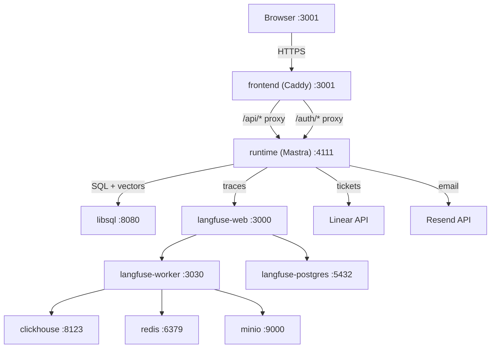

# Triage — AI-Powered SRE Incident Triage Agent

> Intelligent incident triage powered by multi-agent AI. From incident report to verified resolution — automated, observable, and secure. Built for the AgentX Hackathon 2026.


## What Is Triage?

Triage is an SRE agent that automates the entire incident lifecycle. Users describe incidents in natural language through a chat interface — attaching screenshots, log files, or any relevant context. Triage's multi-agent system analyzes a pre-generated knowledge base of the connected codebase (Solidus, a Ruby on Rails e-commerce platform), identifies the likely root cause down to specific files and functions, scores severity, creates a fully detailed ticket in Linear, and notifies the team via email. When the fix ships, Triage verifies the PR/commits against the original issue and notifies the reporter.

**Core E2E flow:** Submit → Triage → Ticket Created → Team Notified → Resolved → Reporter Notified

For agent implementation details, see [`AGENTS_USE.md`](./AGENTS_USE.md). For scaling strategy, see [`SCALING.md`](./SCALING.md). For setup instructions, see [`QUICKGUIDE.md`](./QUICKGUIDE.md).

## Architecture



**9 containers** on 2 Docker networks (`app` + `langfuse`), all with healthchecks and `depends_on: service_healthy`.

## Quick Start

```bash
# 1. Clone the repository
git clone https://github.com/Agentic-Engineering-Agency/triage.git
cd triage

# 2. Configure environment
cp .env.example .env
# Edit .env and replace all CHANGEME values

# 3. Validate secrets (optional)
./scripts/check-env.sh

# 4. Start all services
docker compose up --build
```

Open [http://localhost:3001](http://localhost:3001) to access the Triage dashboard.
Open [http://localhost:3000](http://localhost:3000) to access the Langfuse observability dashboard.

## Tech Stack

| Layer | Technology | Purpose |
|-------|-----------|---------|
| Agent Framework | [Mastra](https://mastra.ai) v1.23 | Multi-agent orchestration, durable workflows, tool system |
| Database | [LibSQL](https://turso.tech/libsql) (sqld) | App data, vector embeddings (F32_BLOB + DiskANN), workflow state |
| ORM | [Drizzle](https://orm.drizzle.team) | Type-safe SQL, schema management, migrations |
| Auth | [Better Auth](https://www.better-auth.com) | Session-based auth with HttpOnly cookies |
| Observability | [Langfuse](https://langfuse.com) v3 | LLM traces, token cost tracking, latency metrics |
| LLM Gateway | [OpenRouter](https://openrouter.ai) | Multimodal LLM access (Qwen 3.6 Plus / Mercury) |
| Frontend | [TanStack Router](https://tanstack.com/router) + [React](https://react.dev) | File-based SPA routing with lazy loading |
| AI UI | [AI SDK](https://sdk.vercel.ai) + [AI SDK Elements](https://sdk.vercel.ai/docs/ai-sdk-ui/chatbot-with-tool-use) | Chat streaming (SSE), generative UI components |
| Reverse Proxy | [Caddy](https://caddyserver.com) v2 | Single-origin architecture, security headers, SSE support |
| UI Components | [shadcn/ui](https://ui.shadcn.com) | Radix-based accessible component library |
| Ticketing | [Linear](https://linear.app) SDK | Issue creation, assignment, status tracking, webhooks |
| Email | [Resend](https://resend.com) | Transactional email notifications |

## Agents

Triage uses 3 specialized agents orchestrated by Mastra durable workflows:

| Agent | Role | Key Capabilities |
|-------|------|-------------------|
| **Orchestrator** | User-facing conversational agent | Batch detection, workflow routing, streaming responses |
| **Triage Agent** | Core intelligence | Codebase RAG, root cause analysis, severity scoring |
| **Resolution Reviewer** | Fix verification | PR/commit analysis, resolution confirmation |

See [`AGENTS_USE.md`](./AGENTS_USE.md) for full agent documentation with architecture diagrams, context engineering details, and security measures.

## Documentation

| Document | Description |
|----------|-------------|
| [`AGENTS_USE.md`](./AGENTS_USE.md) | Agent implementation, architecture, observability, security |
| [`SCALING.md`](./SCALING.md) | Docker → Kubernetes migration path, cost projections |
| [`QUICKGUIDE.md`](./QUICKGUIDE.md) | 5-minute setup guide with troubleshooting |
| [`.env.example`](./.env.example) | All 17 required environment variables with comments |

## Team

| Name | Role | Focus |
|------|------|-------|
| **Lalo** | Lead & Agents | Workflow orchestration, agent design, Linear integration |
| **Lucy (Fernando)** | Infrastructure | Docker Compose, K8s scaffolding, CI/CD, SpecSafe pipeline |
| **Coqui (Koki)** | Runtime & Integrations | Mastra setup, wiki pipeline, security processors, Resend |
| **Chenko** | Frontend | TanStack SPA, chat UI, Kanban board, auth flow |

Built for the AgentX Hackathon 2026 🔧

## License

[MIT](./LICENSE)
