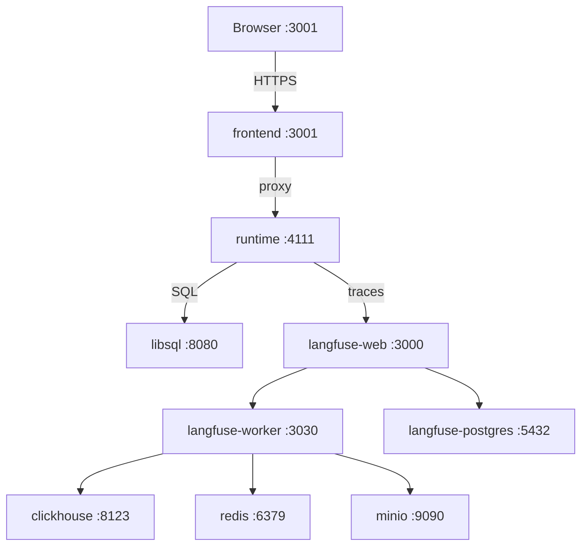

# Triage — SRE Incident Triage Agent

> Intelligent incident triage powered by AI agents. Built for the AgentX Hackathon 2026.


## Architecture



## Quick Start

```bash
# 1. Clone the repository
git clone https://github.com/your-org/triage.git
cd triage

# 2. Configure environment
cp .env.example .env
# Edit .env and replace CHANGEME values

# 3. Start all services
docker compose up --build
```

Open [http://localhost:3001](http://localhost:3001) to access the Triage dashboard.

## Tech Stack

| Layer | Technology | Version |
|-------|-----------|---------|
| Agent Framework | Mastra | 1.23 |
| Database | LibSQL | latest |
| ORM | Drizzle | latest |
| Auth | Better Auth | latest |
| Observability | Langfuse | v3 |
| LLM Gateway | OpenRouter | latest |
| Frontend Router | TanStack Router | latest |
| AI Toolkit | AI SDK | latest |
| Reverse Proxy | Caddy | latest |
| UI Components | shadcn/ui | latest |

## Team Credits

| Name | Role |
|------|------|
| **Lalo** | Lead & Agents |
| **Lucy** | Infrastructure |
| **Coqui** | Runtime & Integrations |
| **Chenko** | Frontend |

Built with love for the AgentX Hackathon 2026.

## License

[MIT](./LICENSE)
