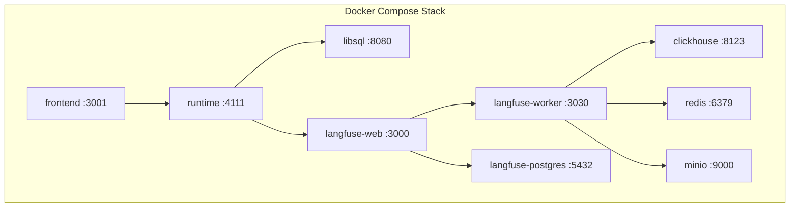
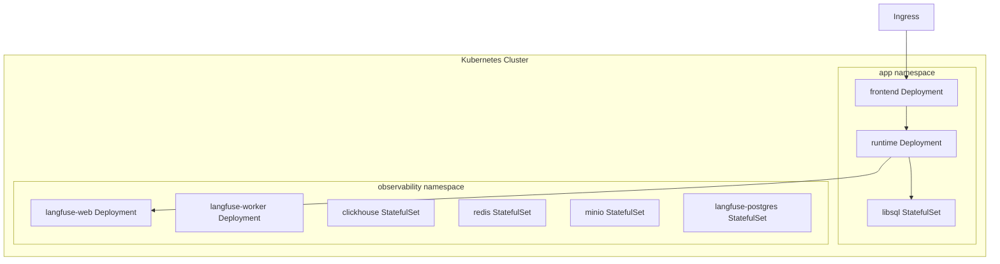

# SCALING — From Docker Compose to Production

> Assumption: the current branch can run stub frontend/runtime containers when the full app code is not present yet. The scaling plan below describes the intended production topology once the real frontend and workflow runtime replace those stubs.

## Current Architecture: Docker Compose

All 9 services run as containers orchestrated by Docker Compose.

## Kubernetes / K8s Migration Path

For production, we migrate to Kubernetes with Helm charts.

## Per-Service Scaling Table

| Service | Scaling Strategy | Replicas (Dev) | Replicas (Prod) | Notes |
|---------|-----------------|----------------|-----------------|-------|
| frontend | Horizontal scaling | 1 | 2-4 | Stateless |
| runtime | Horizontal scaling | 1 | 3-6 | Stateless, CPU-bound |
| libsql | Vertical scaling | 1 | 1 | Single-writer |
| langfuse-web | Horizontal scaling | 1 | 2-3 | Stateless |
| langfuse-worker | Horizontal scaling | 1 | 3-5 | Queue consumers |
| clickhouse | Vertical scaling | 1 | 1-3 | Sharding for scale |
| redis | Vertical scaling | 1 | 1 | Sentinel for HA |
| minio | Horizontal scaling | 1 | 4+ | Erasure coding |
| langfuse-postgres | Vertical scaling | 1 | 1 | Read replicas |

## Bottleneck Analysis

Key bottlenecks identified:

1. **Runtime ↔ LLM latency** — OpenRouter API calls are the primary bottleneck. Mitigate with request batching and caching.
2. **LibSQL write throughput** — Single-writer architecture limits write scaling. Consider sharding or migration to distributed SQL.
3. **ClickHouse ingestion** — High trace volume can saturate ingestion. Buffer via Redis queues.
4. **Network egress** — LLM API calls generate significant outbound traffic.

## Cost Projection

| Scale Tier | Users | Infra Cost/mo | LLM Cost/mo | Total |
|-----------|-------|---------------|-------------|-------|
| Dev | 1-5 | $0 (local) | ~$10 | ~$10 |
| Pilot | 10-50 | ~$150 | ~$200 | ~$350 |
| Production | 100-500 | ~$800 | ~$2,000 | ~$2,800 |
| Scale | 1000+ | ~$3,000 | ~$10,000 | ~$13,000 |

Cost projections assume OpenRouter pricing and managed K8s (EKS/GKE).
