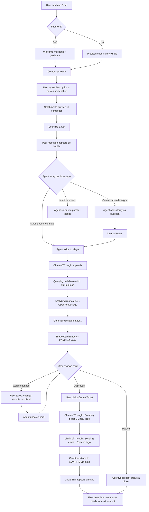
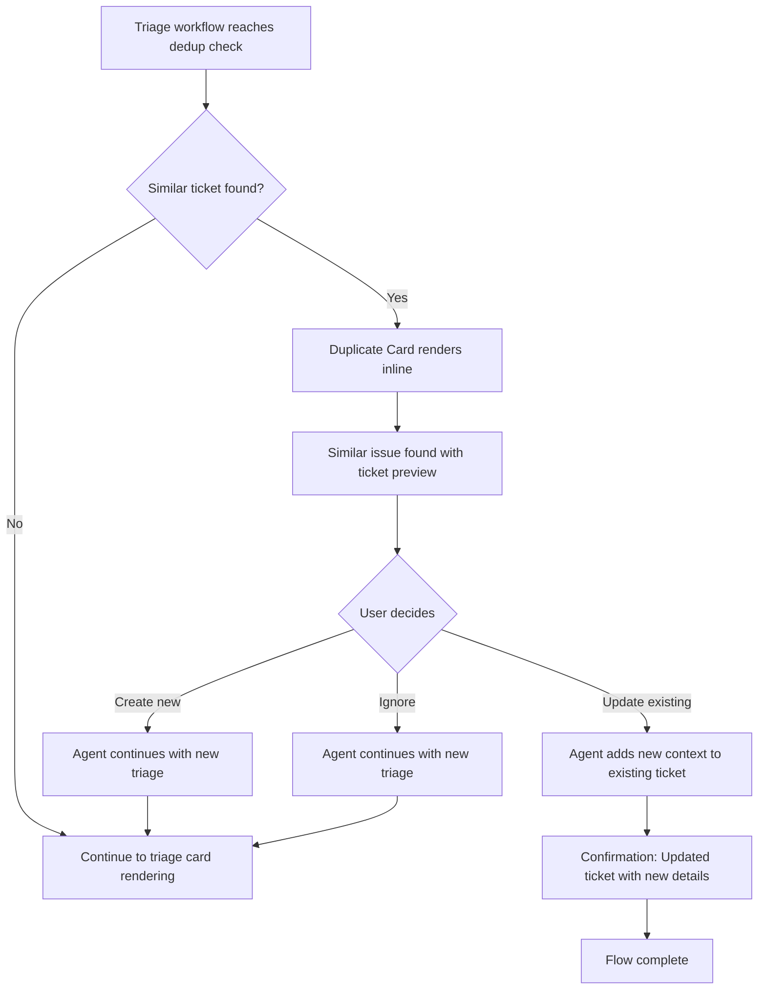
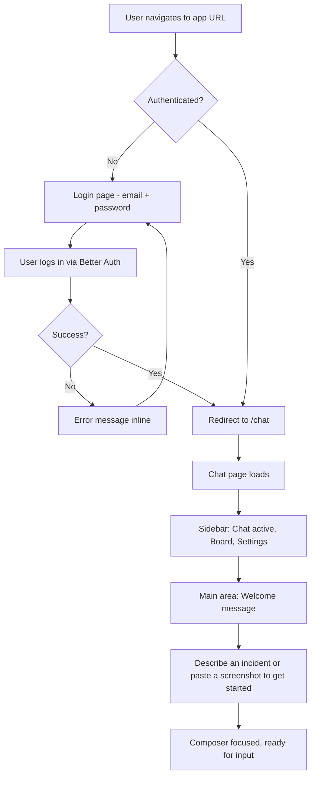

# UX Design Specification — Triage

**Author:** Koki
**Date:** 2026-04-08

---

## Executive Summary

### Project Vision

Triage is an AI-powered SRE agent that automates the full incident management lifecycle for engineering teams. Users report incidents in natural language through a chat interface — attaching screenshots, log files, or stack traces — and the AI agent analyzes a pre-generated knowledge base of the connected codebase, identifies the likely root cause down to specific files and functions, scores severity, assigns the right engineer, creates a detailed ticket in Linear, and notifies the team via email. When the fix ships, Triage verifies the associated PR/commits and notifies the reporter.

The UX is centered on a **chat-first copilot model**: conversational incident intake replaces forms, and structured triage output is rendered inline as rich cards via Mastra's Custom UI pattern (`message.parts` with `tool-{toolKey}` types). The interface is dark-first, information-dense, and designed for the aesthetic expectations of SRE and developer tooling.

### Target Users

**Non-technical reporters (PMs, QA, Support)** — Describe incidents in their own words. Need low-friction input (text + clipboard paste), no technical vocabulary required. Care about knowing their issue was received and when it's resolved.

**Engineers (5-50 developers)** — Receive triaged tickets with root cause analysis citing specific files/functions, confidence scores, proposed fixes, and severity classification. Need information density and trust signals.

**Platform administrators** — One-time project setup: connect a repository, generate the codebase wiki, import team members from Linear, and map expertise areas.

### Key Design Challenges

**1. Chat + Generative UI coexistence.** Triage cards must render inline within conversational flow. Mastra's Custom UI streams tools as `tool-{toolKey}` parts in `message.parts`, rendered as React components per state (`input-available` → skeleton, `output-available` → full card, `output-error` → error state). AI SDK Elements provides the `Tool` component with built-in state management and the `Confirmation` component for the approval gate before Linear ticket creation.

**2. Communicating confidence and uncertainty.** A triage with 91% confidence and one with 52% must look visually distinct. Visual treatment should scale with confidence level — prominent vs. muted presentation. Engineers trust tools that are honest about uncertainty.

**3. Multimodal input without friction.** AI SDK Elements `PromptInput` handles text + clipboard paste + file picker + drag-drop with built-in `maxFileSize`, `accept`, `globalDrop`, and image previews. The composer must feel like a single fluid action, not an upload form.

### Design Opportunities

**1. Trust through transparency.** Showing the agent's reasoning — which files it queried, confidence score, severity rationale — creates a verifiable AI experience. AI SDK Elements' `Reasoning` and `Chain of Thought` components provide a ready-made pattern for this, connecting directly to the Mastra tool execution pipeline. Engineers trust what they can check.

**2. Severity as a unified color language.** Consistent severity colors (Critical/High/Medium/Low) across cards, badges, Kanban columns, and notifications create immediate visual feedback — one glance tells the story.

**3. Closed-loop resolution visualization (post-MVP).** The verified resolution flow (PR confirmed → reporter notified) is unique to Triage. Visualizing this as a cycle that closes would reinforce the product's core value — but this is a post-hackathon enhancement. MVP focuses on the functional E2E flow first.

### Design System Foundation

#### Visual Style: Hybrid Neumorphism (Soft UI)

A hybrid neumorphic approach combines soft shadow depth with flat high-contrast data elements:

- **Raised neumorphic**: Triage cards, Kanban ticket cards, input composer, nav elements — soft outer shadows creating floating depth
- **Inset neumorphic**: Search fields, text areas, secondary containers — inner shadows creating recessed feel
- **Flat/solid (no neumorphism)**: Severity badges, CTA buttons, status dots, confidence bars, file reference chips — maximum contrast and scanability

This preserves information density for data-heavy elements while giving the interface a distinctive, modern tactile quality that differentiates from flat SRE tools.

#### Color Palette (Brand-Aligned)

Derived from the [Agentic Engineering](https://agenticengineering.agency/) brand identity, adapted for a dark-first SRE tool interface.

| Token | Hex | Role |
|-------|-----|------|
| Deep Navy | `#1F337A` | Backgrounds, surfaces, dark canvas |
| Orange | `#F28B0D` | CTAs, highlights, interactive accents, High severity |
| Steel Blue | `#6A81C7` | Links, active states, secondary interactive, Medium severity |
| Coral | `#F06B50` | Critical severity, errors, destructive actions |
| White | `#FFFFFF` | Primary text on dark surfaces |
| Muted Blue | `#8A9DD4` | Secondary text, subtle elements, Low severity |

#### Severity Color Mapping

| Level | Color | Token | Definition |
|-------|-------|-------|------------|
| Critical | `#F06B50` Coral | System down, data loss |
| High | `#F28B0D` Orange | Major feature broken |
| Medium | `#6A81C7` Steel Blue | Degraded experience |
| Low | `#8A9DD4` Muted Blue | Cosmetic, minor |

#### Typography

| Role | Font | Notes |
|------|------|-------|
| Headings | Space Grotesk | Brand typeface, geometric sans-serif |
| Body / UI | Inter | System-optimized readability, variable font |
| Code / Monospace | JetBrains Mono | File paths, stack traces, code references |

#### Neumorphic Shadow Tokens (Tailwind)

```
neu-raised: '6px 6px 12px #141d52, -6px -6px 12px #2a49a2'
neu-inset:  'inset 4px 4px 8px #141d52, inset -4px -4px 8px #2a49a2'
neu-sm:     '3px 3px 6px #141d52, -3px -3px 6px #2a49a2'
```

### Component Library Strategy

**Primary: AI SDK Elements** (`elements.ai-sdk.dev`) — Built on shadcn/ui, same ecosystem as `useChat` and `@ai-sdk/react`. Provides composable, styleable components that map directly to Triage's needs:

| Elements Component | Triage Use |
|---------------------|------------|
| `PromptInput` + `Attachments` | Multimodal composer (text + paste + files + drag-drop) |
| `Message` + `MessageResponse` | Chat messages with markdown, syntax highlighting, streaming |
| `Tool` (Header, Input, Output) | Triage card rendering with state management |
| `Confirmation` | Approval gate before Linear ticket creation |
| `Shimmer` | Loading states during agent processing |
| `Reasoning` / `Chain of Thought` | Agent transparency (trust signal) |
| `Sources` / `Inline Citation` | Codebase file references from wiki RAG |
| `Conversation` | Chat container with history |

**Supplementary: Aceternity UI** (free components) — Cherry-pick for visual polish: `File Upload` (drag-drop visual), `Timeline` (incident history), `Codeblock` (triage output), `Glowing Effect` (neumorphic accent).

**Reference: assistant-ui** (`assistant-ui.com`) — Not a dependency, but reference for advanced patterns: custom tool rendering (`makeAssistantToolUI`), thread management, Mastra runtime adapter. Consider for post-hackathon if multi-conversation support is needed.

## Core User Experience

### Defining Experience

The core interaction that defines Triage is the **chat-to-triage-card loop**: a user describes a problem in natural language, optionally pastes a screenshot, and within 60 seconds sees a structured triage card appear inline with root cause analysis, file references, confidence score, severity, and a proposed fix. The user reviews, adjusts via chat if needed ("change severity to critical"), confirms, and a Linear ticket is created — all without leaving the conversation.

Everything else in the product (Kanban board, project setup, auth) exists to support this single loop. If this interaction feels fast, transparent, and trustworthy, the product succeeds.

### Platform Strategy

**Web-first SPA.** The primary experience is browser-based at localhost, accessed during development workflows. Desktop wrapper (Electron/Tauri) is a post-hackathon stretch goal that simply wraps the web app — no native features required.

- **Input mode:** Mouse/keyboard primary. Clipboard paste (`Ctrl+V`) is the critical input gesture for screenshots.
- **Screen size:** Optimized for standard developer monitors (1440px+). The demo will be shown on a large screen — information density matters.
- **No offline requirement.** Triage depends on LLM APIs, Linear, and the codebase wiki — always-connected by nature.
- **No mobile optimization for MVP.** Responsive baseline via shadcn/ui, but no mobile-specific UX work.

### Effortless Interactions

**1. Screenshot paste is the gold standard.** A user takes a screenshot (`Cmd+Shift+4` / `Win+Shift+S`), switches to Triage, hits `Ctrl+V`, sees the image thumbnail appear in the composer, types a sentence, hits Enter. Zero file dialogs, zero drag-and-drop friction. This must work exactly like pasting an image into Slack or Discord — the interaction users already know.

**2. Chat-based adjustment instead of form editing.** After a triage card renders, the user doesn't click into fields to edit. They type "assign this to Diego instead" or "this is actually critical, not high" and the agent updates. Conversation is the interface — no modal forms, no edit buttons on the card itself.

**3. One-click ticket creation.** The triage card has a single "Create Ticket" confirmation button. One click → Linear ticket exists → team notified. The approval gate is intentional (no accidental tickets), but the action itself is instant.

**4. Auto-detected input style.** If the user pastes a raw stack trace, the agent skips clarifying questions and goes straight to analysis. If the user writes "the checkout is broken," the agent may ask one follow-up. The system adapts — the user never has to choose a mode.

### Critical Success Moments

**1. The triage card appears with real file references.** This is the "wow" moment — when the card shows `solidus_core/app/models/spree/payment.rb` with a confidence score of 87% and a proposed fix. The user (and the hackathon judges) realize this isn't keyword matching — it actually understands the codebase. This moment must feel fast and precise.

**2. The full E2E flow is visible through Chain of Thought.** The Chain of Thought component serves as a live progress feed for the entire pipeline: querying the codebase wiki → analyzing root cause → creating the Linear ticket → sending the email notification. Each step appears in real-time as the agent executes it. The user watches the pipeline unfold — ticket created, email sent — all visible within the chat. This is what proves to judges it's functional, not a mockup.

**3. The reasoning is expandable and verifiable.** When the user can expand the agent's Chain of Thought and see which wiki documents it queried, what it considered, and why it chose a specific severity — that's trust earned. The dual-purpose Chain of Thought (reasoning + pipeline progress) means the user sees both *what* the agent did and *why*.

### Experience Principles

**1. Conversation is the interface.** Every interaction — reporting, adjusting, confirming — happens through chat. The triage card is output, not input. Users never fill forms.

**2. Paste-and-go.** Multimodal input must be as effortless as messaging apps users already use daily. Screenshot paste is not a feature — it's the baseline expectation.

**3. Transparency builds trust.** Confidence scores, file references, and expandable Chain of Thought reasoning are not optional data — they are the product's credibility. Show the work.

**4. Functional first, polish second.** The hackathon judges evaluate execution quality. A complete E2E flow that works beats a beautiful UI that doesn't. Every UX decision must serve the working demo.

## Desired Emotional Response

### Primary Emotional Goals

**Confidence** — "This agent knows what it's doing." The confidence score, real file references, and expandable Chain of Thought create this. When the agent says 87% confidence on a specific file, the user trusts it because they can verify it. Every piece of data shown is checkable.

**Relief** — "I don't have to do the tedious work." The PM reporting "checkout broken" feels relief from not filling 10 form fields. The engineer receiving the ticket feels relief from not grepping the codebase for 45 minutes. The time saved is immediately tangible.

**Control** — "I decide when the ticket gets created." The approval gate ("Create Ticket" button) and the ability to adjust via chat ("change severity to critical") ensure the human is in command. The AI proposes, the human disposes.

### Emotional Journey Mapping

| Stage | Desired Emotion | How We Create It |
|-------|----------------|------------------|
| First encounter | Curiosity → "This looks professional" | Dark neumorphic aesthetic, brand-aligned design, clean layout |
| Reporting an incident | Ease → "This is just like Slack" | Clipboard paste, natural language, no forms |
| Waiting for triage | Engagement → "I can see it working" | Chain of Thought with service logos (svgl) showing real-time pipeline progress |
| Triage card appears | Impression → "It actually found the file" | Real file references, confidence score, severity badge |
| Reviewing the triage | Control → "I can adjust this" | Chat-based editing, approval gate |
| Ticket created + email sent | Satisfaction → "Done in 30 seconds" | Visible confirmation in Chain of Thought with Linear logo + email logo |
| Error or low confidence | Trust → "At least it's honest" | Explicit low-confidence flags, "I'm not sure" language, expandable reasoning |

### Micro-Emotions

**Critical micro-emotions for Triage:**

- **Confidence over Skepticism** — The most important axis. Engineers are skeptical of AI tools by default. Every design decision must earn trust: show the evidence, show the reasoning, show the confidence level. Never hide uncertainty.
- **Accomplishment over Frustration** — The moment the triage card appears with accurate analysis, the user feels "that would have taken me 45 minutes." This must happen fast (<60s) to feel earned, not waited for.
- **Trust over Anxiety** — "Did the ticket get created? Did the email send?" The Chain of Thought with branded service logos (Linear, Gmail via svgl.app) shows each pipeline step completing in real-time. No black boxes.

### Design Implications

| Emotion | UX Design Approach |
|---------|-------------------|
| Confidence | Confidence scores prominently displayed, not buried. File references as clickable chips. Chain of Thought always available. |
| Relief | Zero-config input — paste and type. No mode selection, no required fields, no multi-step forms. |
| Control | Approval gate before ticket creation. Chat-based adjustments. User can say "don't create the ticket" and the agent respects it. |
| Trust | Pipeline progress visible via Chain of Thought with branded service logos (svgl.app SVGs for Linear, GitHub, email). Each step shows completion status. |
| Avoiding anxiety | No silent operations. Every action the agent takes is visible. Errors are surfaced immediately with clear language, not hidden behind generic "something went wrong." |

### Emotional Design Principles

**1. Show, don't tell.** Don't say "analyzing codebase" — show the Chain of Thought with the GitHub logo and which files are being queried. Don't say "ticket created" — show the Linear logo with a link to the actual ticket.

**2. Honesty is a feature.** Low confidence scores are not failures — they are trust builders. An agent that says "I'm 52% sure this is the issue" is more trustworthy than one that always says "I found the problem!" Honest uncertainty is better than false certainty.

**3. Speed communicates competence.** A triage that completes in 30 seconds feels competent. The same triage taking 3 minutes feels broken, even if the result is identical. Performance is an emotional design decision.

### Icon & Logo Resources

**svgl.app** (`svgl.app`) — Open-source library of 604+ curated SVG logos with API and npm package access. Used across the entire application for consistent, professional brand iconography:

- **Chain of Thought pipeline**: Linear logo (ticket creation), Gmail/Resend logo (email), GitHub logo (codebase analysis), OpenRouter logo (LLM inference)
- **Kanban board**: Linear logo on synced tickets, severity icons
- **Project setup**: GitHub logo for repo connection, Linear logo for user import
- **Auth pages**: Product branding
- **General UI**: Service status indicators, integration badges

## UX Pattern Analysis & Inspiration

### Inspiring Products Analysis

**Linear** — The primary UX reference. Engineers live in Linear daily.
- Keyboard-first navigation, information-dense but scannable
- Dark mode as default, not an afterthought
- Status/priority colors are instantly recognizable — no legend needed
- Minimal chrome — content dominates, UI disappears
- *What to take:* Severity badges, card density, dark-first aesthetic, keyboard shortcuts

**Slack / Discord** — The mental model for input.
- Paste an image from clipboard → it appears inline. No dialog, no confirmation.
- Type naturally, hit Enter, done. The input area is a conversation, not a form.
- Rich previews (link unfurls, image thumbnails) appear without user action
- *What to take:* Clipboard paste behavior, message input feel, attachment previews

**Sentry** — The SRE reference for error/incident data.
- Stack traces rendered with syntax highlighting and file references
- Breadcrumb timelines showing event sequence
- Issue grouping and deduplication visual patterns
- *What to take:* Stack trace rendering in triage cards, breadcrumb-style Chain of Thought, severity indicators

**Manus** — AI agent task execution UX.
- Task-oriented design: the agent shows what it's *doing*, not just what it's *saying*
- Progress visualization with spinner animations and step indicators
- Clean, professional aesthetic that focuses on output, not decoration
- *What to take:* Pipeline progress visualization in Chain of Thought — show the agent acting, not just thinking

**Kimi** — Modular AI ecosystem feel.
- Quick chat initiation (`Ctrl+K`), sidebar with conversation history
- Progressive disclosure — simple chat that can escalate to deeper workflows
- Modular feature access without leaving the core interface
- *What to take:* The feeling of an integrated ecosystem — chat, board, and setup feel like one product, not three separate pages

**assistant-ui examples** — Direct implementation reference patterns.
- *Generative UI Showcase:* Tool results (charts, forms, data visualizations) rendered as interactive React components inline in chat — not modals, not separate panels. Streaming args enable partial UI rendering as tool data arrives progressively. This is the exact pattern for triage card rendering.
- *LangGraph Stockbroker (human-in-the-loop):* Approval gate using `makeAssistantToolUI` with `addResult({ approved: true/false })`. The UI shows "Trade Approval Required" with Approve/Reject buttons, conditional rendering based on `status.type === 'requires-action'`. This maps directly to Triage's "Create Ticket" approval gate — same pattern, different domain.
- *Perplexity Clone:* Dark theme with cyan accents — close to Triage's Deep Navy + Steel Blue aesthetic. Reference for dark mode implementation.

### Transferable UX Patterns

**Navigation Patterns:**
- **Minimal sidebar + content area** (Linear) — Sidebar for navigation between Chat/Board/Settings, main area is 100% content. No top nav bars eating vertical space.
- **Quick action shortcut** (Kimi) — `Ctrl+K` or similar for instant new incident report from anywhere in the app.

**Interaction Patterns:**
- **Paste-and-preview** (Slack) — Clipboard paste creates an inline removable thumbnail. No upload dialog. The message isn't sent until Enter — the preview sits in the composer.
- **Progressive disclosure** (Sentry/Manus) — Triage card shows summary by default. Technical details (file references, proposed fix, full reasoning) are expandable. Don't overwhelm non-technical reporters.
- **Pipeline-as-progress** (Manus) — Chain of Thought shows agent actions as they happen: analyzing → querying wiki → creating ticket → sending email. Each step with its service logo (svgl).
- **Inline approval gate** (assistant-ui Stockbroker) — Approval renders as an interactive component within the chat flow. Approve/Reject buttons appear inline, not as a modal dialog. State transitions visually (pending → approved → completed).
- **Streaming tool results** (assistant-ui Generative UI) — Triage card can begin rendering as structured data arrives (title first, then severity, then file references). Progressive rendering keeps the user engaged during the <60s triage window.

**Visual Patterns:**
- **Severity as color language** (Linear) — Critical/High/Medium/Low mapped to Coral/Orange/Steel Blue/Muted Blue. Applied consistently everywhere: badges, Kanban columns, card borders.
- **Dark canvas with high-contrast data** (Sentry/Grafana) — Deep Navy backgrounds, bright data elements. Neumorphic cards float above the surface.
- **Inline rich cards** (Slack unfurls) — Triage cards appear inline in conversation, not as popups or modals. They're part of the chat flow.

### Anti-Patterns to Avoid

- **Form-based incident reporting** — Every competitor (Jira, PagerDuty) makes you fill forms. Triage's differentiator is that conversation replaces forms. Never add a "create incident" form.
- **Hidden AI reasoning** — ChatGPT shows a spinner and then output. Triage must show *what the agent is doing* (Chain of Thought), not just the result. Opacity kills trust.
- **Mode selection** — Don't make users choose "conversational mode" vs. "quick mode" vs. "batch mode." The agent detects intent from input automatically.
- **Notification overload** — Don't toast/banner every small action. Chain of Thought handles progress. Only surface errors and confirmations (ticket created) as distinct UI events.
- **Dashboard-first design** — Triage is chat-first. The Kanban board is secondary. Don't make the dashboard the landing page — drop users into chat immediately.
- **Modal approval dialogs** — The Stockbroker example proves approval can happen inline. Don't pop a modal for "Are you sure you want to create this ticket?" — render the approval as part of the card.

### Design Inspiration Strategy

**Adopt directly:**
- Linear's severity color system and badge design
- Slack's clipboard paste → inline preview → send flow
- Manus's pipeline progress visualization pattern
- assistant-ui's inline approval gate pattern (Stockbroker)
- assistant-ui's streaming tool result rendering (Generative UI)

**Adapt for Triage:**
- Sentry's stack trace rendering → adapted for triage card file references (file path chips with line numbers, not full stack traces)
- Kimi's modular ecosystem feel → simplified to 3 routes (Chat / Board / Settings) in a minimal sidebar
- Linear's keyboard shortcuts → essential ones only for MVP (`Ctrl+K` new chat, `Enter` send, `Esc` cancel)
- Perplexity Clone's dark theme → adapted to Triage's Deep Navy + neumorphic style

**Avoid:**
- Jira's form complexity — conversation is the interface
- ChatGPT's opaque processing — always show Chain of Thought
- Grafana's dashboard density — Triage is chat-first, not dashboard-first
- Modal-based confirmations — approvals happen inline in the chat flow

## Design System Foundation (Detailed)

### Design System Choice

**Themeable System: shadcn/ui + AI SDK Elements + Hybrid Neumorphism**

A layered approach that combines proven component primitives with custom visual styling:

1. **shadcn/ui** (base layer) — Radix UI primitives with Tailwind CSS. Provides accessible, composable components (Button, Card, Badge, Dialog, etc.) with zero runtime overhead. Components are copied into the project, not imported from a package — full ownership and customization.

2. **AI SDK Elements** (AI layer) — Chat-specific components built on shadcn/ui. PromptInput, Message, Tool, Confirmation, Shimmer, Reasoning, Sources. Same styling system, no additional dependency conflicts.

3. **Hybrid Neumorphism** (visual layer) — Custom Tailwind shadow utilities (`neu-raised`, `neu-inset`, `neu-sm`) applied on top of shadcn/ui components. This is a CSS-only layer — no component logic changes. Neumorphic surfaces for cards and containers, flat/solid for data elements (badges, buttons, status indicators).

### Rationale for Selection

- **Already in the stack.** shadcn/ui is specified in the architecture and initialized via `npx shadcn@latest init --template vite`. No new dependency decision needed.
- **AI SDK Elements is native.** Same ecosystem as `useChat` and `@ai-sdk/react` — the chat infrastructure is already built on AI SDK. Elements adds the UI components.
- **Full customization control.** shadcn/ui copies components into the project. We can modify any component's internals to apply neumorphic styling without fighting a library's constraints.
- **48-hour hackathon constraint.** No time to build a custom design system. No time to learn a new framework (Material, Ant). shadcn/ui is already known to the team and requires zero learning curve.
- **Accessibility baseline.** Radix UI primitives provide keyboard navigation, ARIA attributes, and focus management out of the box — meeting the accessibility baseline without additional effort.

### Implementation Approach

**Component installation (shadcn CLI):**
```bash
npx shadcn@latest add button card badge separator skeleton dialog input textarea
```

**AI SDK Elements installation:**
```bash
pnpm add @ai-sdk/elements
```

**Neumorphic layer — Tailwind config extension:**
```ts
// tailwind.config.ts
theme: {
  extend: {
    boxShadow: {
      'neu-raised': '6px 6px 12px #141d52, -6px -6px 12px #2a49a2',
      'neu-inset': 'inset 4px 4px 8px #141d52, inset -4px -4px 8px #2a49a2',
      'neu-sm': '3px 3px 6px #141d52, -3px -3px 6px #2a49a2',
    },
    colors: {
      navy: '#1F337A',
      'steel-blue': '#6A81C7',
      orange: '#F28B0D',
      coral: '#F06B50',
      'muted-blue': '#8A9DD4',
    },
    fontFamily: {
      heading: ['Space Grotesk', 'sans-serif'],
      body: ['Inter', 'sans-serif'],
      mono: ['JetBrains Mono', 'monospace'],
    },
  },
}
```

### Customization Strategy

**What we customize:**
- shadcn/ui CSS variables in `globals.css` → mapped to our brand palette (Deep Navy, Orange, Steel Blue, etc.)
- Card component → add `shadow-neu-raised` class for neumorphic surfaces
- Input/Textarea → add `shadow-neu-inset` for recessed feel
- Badge → flat with severity colors (no neumorphism — maximum contrast)
- Button (CTA) → Orange background, flat. Button (secondary) → `shadow-neu-sm`

**What we keep as-is:**
- Radix UI primitive behavior (Dialog, Popover, Tooltip) — no visual customization needed for MVP
- AI SDK Elements component logic (Tool states, Confirmation flow, PromptInput attachments)
- Accessibility behavior from Radix (keyboard nav, focus management, ARIA)

**Component ownership model:**
- shadcn components live in `frontend/src/components/ui/` — owned, editable
- AI SDK Elements used as package imports — styled via Tailwind classes, not modified internally
- Custom components (TriageCard, KanbanColumn, SeverityBadge) live in `frontend/src/components/` — built on top of shadcn primitives

## Defining Experience (Detailed)

### The One-Liner

**"Describe a bug, see the root cause in 30 seconds."**

This is what users will tell colleagues. Not "AI-powered SRE agent" — just "you describe the bug, it finds the file and creates the ticket."

### User Mental Model

Users bring the **Slack/chat mental model**: type something, hit Enter, get a response. They don't think of this as "submitting an incident to a triage system" — they think of it as "telling someone about a problem." The agent is the colleague who already knows the codebase.

- **What they expect:** Type naturally → get an intelligent response → see a ticket appear
- **Where confusion could happen:** If the triage card looks too different from a chat message, users may not realize it's interactive (has an approval button). The card must feel like part of the conversation, not a foreign widget.
- **Workarounds they currently use:** Ping Slack → wait → answer 5 questions → someone manually creates a Jira ticket → no verification. Triage replaces this entire chain.

### Novel vs. Established Patterns

**Established patterns we use (no learning curve):**
- Chat input (Slack mental model)
- Clipboard paste (OS-native behavior)
- Card with expandable details (Linear tickets)
- Severity color badges (universal in dev tools)
- Sidebar navigation (every SPA)

**Novel pattern that needs clear affordance:**
- **Inline approval gate on triage card.** The "Create Ticket" button on the card is not a standard chat pattern. Users need to understand that the card is a *proposal*, not a confirmed ticket. Visual treatment: the card renders with a subtle "pending" state (dashed border or muted opacity) until approved. After approval, it transitions to a "confirmed" state (solid border, Linear link appears).

**Novel pattern that needs no teaching:**
- **Chain of Thought as pipeline progress.** Users naturally understand a step-by-step list with checkmarks. "Analyzing codebase... -> Creating ticket... -> Sending email..." with service logos is self-explanatory.

### Experience Mechanics

**1. Initiation:**
- User lands on `/chat` (default route after login)
- Empty state: welcome message + "Describe an incident or paste a screenshot to get started"
- Input: PromptInput composer at the bottom, always visible

**2. Interaction (the core loop):**
- User types description + optionally pastes screenshot (`Ctrl+V`)
- Image thumbnail appears in composer as removable preview
- User hits Enter → message appears in chat as user bubble
- Agent responds with streaming text (clarifying question OR direct triage)
- If clarifying: user answers → agent proceeds to triage
- Chain of Thought expands showing: querying wiki → analyzing → generating triage
- Triage card renders inline with: severity badge, confidence score, title, summary, file references (collapsed), proposed fix (collapsed), "Create Ticket" button

**3. Feedback:**
- Chain of Thought with service logos (svgl) shows real-time pipeline progress
- Triage card renders in "pending" state — user knows this is a proposal
- Confidence score communicates certainty level visually
- If confidence is low (<60%), card shows a visual warning: "Low confidence — verify before creating"

**4. Completion:**
- User clicks "Create Ticket" → card transitions to "confirmed" state
- Chain of Thought shows: "Creating ticket in Linear..." (with Linear logo) → "Sending email to assignee..." (with email logo)
- Card updates: Linear link appears, status changes to "Ticket Created"
- User knows they're done — the card is the confirmation

## Visual Design Foundation (Detailed)

### Color System

Semantic mapping to shadcn/ui CSS variables:

```css
/* globals.css — dark theme (default) */
:root {
  --background: #1F337A;          /* Deep Navy */
  --foreground: #FFFFFF;           /* White */
  --card: #243b8a;                 /* Navy lighter — card surfaces */
  --card-foreground: #FFFFFF;
  --primary: #F28B0D;              /* Orange — CTAs, highlights */
  --primary-foreground: #FFFFFF;
  --secondary: #6A81C7;            /* Steel Blue — links, interactive */
  --secondary-foreground: #FFFFFF;
  --muted: #2a4494;                /* Navy muted — disabled, subtle bg */
  --muted-foreground: #8A9DD4;     /* Muted Blue — secondary text */
  --destructive: #F06B50;          /* Coral — errors, critical */
  --destructive-foreground: #FFFFFF;
  --accent: #6A81C7;               /* Steel Blue */
  --accent-foreground: #FFFFFF;
  --border: #2a4494;               /* Navy border */
  --input: #2a4494;                /* Input borders */
  --ring: #F28B0D;                 /* Focus ring — Orange */
  --radius: 0.625rem;              /* 10px — matches brand */
}
```

### Typography System

| Level | Font | Size | Weight | Line Height | Use |
|-------|------|------|--------|-------------|-----|
| H1 | Space Grotesk | 2rem (32px) | 700 | 1.2 | Page titles |
| H2 | Space Grotesk | 1.5rem (24px) | 600 | 1.3 | Section headers |
| H3 | Space Grotesk | 1.25rem (20px) | 600 | 1.4 | Card titles, triage card title |
| Body | Inter | 0.875rem (14px) | 400 | 1.5 | Default text, chat messages |
| Body Small | Inter | 0.8125rem (13px) | 400 | 1.5 | Secondary info, timestamps |
| Caption | Inter | 0.75rem (12px) | 500 | 1.4 | Labels, badge text, metadata |
| Code | JetBrains Mono | 0.8125rem (13px) | 400 | 1.6 | File paths, stack traces, inline code |

**Rationale:** 14px body text is standard for dev tools (Linear uses 14px, Sentry uses 14px). Engineers prefer density over large text. Space Grotesk for headings creates visual distinction without being decorative.

### Spacing & Layout Foundation

**Base unit:** 4px. All spacing is a multiple of 4.

| Token | Value | Use |
|-------|-------|-----|
| `space-1` | 4px | Inline padding, icon gaps |
| `space-2` | 8px | Compact spacing, badge padding |
| `space-3` | 12px | Input padding, small gaps |
| `space-4` | 16px | Standard gap between elements |
| `space-6` | 24px | Card padding, section gaps |
| `space-8` | 32px | Large section separation |
| `space-12` | 48px | Page-level spacing |

**Layout structure:**
- **Sidebar:** Fixed 240px width (collapsible to 64px icon-only). Contains: logo, nav links (Chat, Board, Settings), user avatar.
- **Main area:** Fluid, fills remaining width. No max-width constraint — engineers use wide monitors.
- **Chat layout:** Messages stack vertically, full width. Triage cards span the full message area. Composer fixed to bottom.
- **Kanban layout:** Horizontal columns, each 280px min-width, scrollable horizontally.

**Density:** Information-dense by default. Compact padding (12px card padding, 8px between card elements). No excessive whitespace — this is a tool, not a marketing page.

### Accessibility Considerations

**Contrast ratios (WCAG AA minimum):**
- White (#FFF) on Deep Navy (#1F337A) → 8.5:1 (passes AAA)
- Orange (#F28B0D) on Deep Navy (#1F337A) → 4.6:1 (passes AA)
- Steel Blue (#6A81C7) on Deep Navy (#1F337A) → 3.2:1 (passes AA for large text only — use for headings/buttons, not body text)
- Coral (#F06B50) on Deep Navy (#1F337A) → 4.1:1 (passes AA)
- Muted Blue (#8A9DD4) on Deep Navy (#1F337A) → 3.8:1 (passes AA for large text — acceptable for secondary/caption text at 12px+ with 500 weight)

**Keyboard navigation:** Provided by Radix UI primitives (shadcn/ui). All interactive elements focusable, dialogs trap focus, escape closes overlays.

**Focus indicators:** Orange ring (`--ring: #F28B0D`) — high visibility on dark backgrounds.

**Motion:** Respect `prefers-reduced-motion`. Chain of Thought animations and card transitions should have reduced-motion alternatives.

## Design Direction Decision

### Chosen Direction

**Single converged direction: Dark Neumorphic Chat-First SRE Tool.** No variation exploration needed — all design decisions were made collaboratively through Steps 2-8.

### Design Rationale

The design direction was driven by three constraints that naturally converged:

1. **Brand alignment** — Deep Navy + Orange + Steel Blue palette extracted from agenticengineering.agency
2. **User expectations** — SRE/dev tool aesthetic (Linear, Sentry, Grafana) demands dark-first, information-dense, keyboard-friendly
3. **Technical stack** — shadcn/ui + AI SDK Elements + Tailwind dictates a component-driven approach where neumorphism is a CSS layer, not a component library

### Key Visual Decisions (Locked)

- Dark neumorphic surfaces (raised cards, inset inputs) on Deep Navy canvas
- Flat high-contrast severity badges and status indicators (no neumorphism on data elements)
- Chat-first layout: sidebar (240px) + fluid main area + fixed composer
- AI SDK Elements for all chat components, styled with Tailwind neumorphic utilities
- Service logos via svgl.app throughout the interface
- Space Grotesk headings, Inter body, JetBrains Mono code — all at dev-tool-standard 14px base

## User Journey Flows

### Journey 1: Incident Report → Triage → Ticket (Core Loop)

The primary flow — covers both conversational (PM) and direct (engineer with stack trace) paths.



### Journey 2: Duplicate Detection

Triggered during the triage flow when a semantically similar ticket exists.



### Journey 3: Login → First Chat

First-time user experience — minimum friction to the core loop.



### Journey Patterns

**Common patterns across all flows:**

| Pattern | Implementation |
|---------|---------------|
| Entry point | Always `/chat` — the default route after auth |
| Feedback loop | Chain of Thought with service logos shows every agent action |
| Error recovery | Errors surface inline in chat, never as modals. Agent suggests retry. |
| State transitions | Cards transition visually: pending (dashed border) → confirmed (solid border + link) |
| Progressive disclosure | Summary visible by default, technical details collapsed |
| User control | All agent proposals require explicit user approval before external actions |

### Flow Optimization Principles

1. **Zero-step-to-input.** After login, the user is on `/chat` with composer focused. No onboarding wizard, no dashboard, no setup flow. Type and go.
2. **Parallel, not sequential.** Batch submissions trigger parallel triages. The user sees multiple cards appear, not a queue.
3. **Inline everything.** Duplicate detection, approvals, errors, confirmations — all happen in the chat stream. No page changes, no modals, no toasts.
4. **Graceful degradation is invisible.** If Linear is down, tickets are created locally. If email fails, it's logged. The user flow never breaks — fallbacks happen silently with a note in Chain of Thought.

## Component Strategy

### Design System Components (Available)

**From shadcn/ui (install via CLI):**

| Component | Triage Use |
|-----------|-----------|
| `Button` | CTAs, approval actions, navigation |
| `Card` | Base for TriageCard, KanbanCard containers |
| `Badge` | Base for SeverityBadge |
| `Input` | Login form, settings |
| `Dialog` | Settings dialogs (not for approvals — those are inline) |
| `Separator` | Visual dividers in cards, sidebar |
| `Skeleton` | Loading states |
| `Avatar` | User avatar in sidebar, assignee in cards |
| `Tooltip` | Hover info on badges, file references |
| `ScrollArea` | Chat message scroll, Kanban horizontal scroll |

**From AI SDK Elements (npm package):**

| Component | Triage Use |
|-----------|-----------|
| `Conversation` | Chat container with message list |
| `Message` + `MessageResponse` | User/assistant messages with markdown rendering |
| `PromptInput` + `Attachments` | Multimodal composer (text + paste + files) |
| `Tool` + `ToolHeader` + `ToolOutput` | Base wrapper for triage tool results |
| `Confirmation` | Approval gate for ticket creation |
| `Shimmer` | Loading animation during triage |
| `Reasoning` | Chain of Thought collapsible section |
| `Sources` | File reference citations |

### Custom Components

7 custom components needed — built on shadcn primitives, styled with neumorphic utilities.

#### TriageCard

**Purpose:** Display structured triage output inline in chat. The core visual component of the product.
**Wraps:** AI SDK Elements `Tool` component (handles state lifecycle)
**Anatomy:**
- Header: severity badge (left) + confidence score (right)
- Title: H3, triage title text
- Summary: Body text, 2-3 lines visible
- File References: collapsible section — list of FileReference chips
- Proposed Fix: collapsible section — body text
- Footer: "Create Ticket" button (pending state) OR Linear link (confirmed state)

**States:**

| State | Visual Treatment |
|-------|-----------------|
| Loading | Shimmer skeleton in card shape |
| Pending | `shadow-neu-raised`, dashed border (`border-dashed border-orange`), "Create Ticket" button visible |
| Confirmed | `shadow-neu-raised`, solid border (`border-steel-blue`), Linear link replaces button |
| Error | `shadow-neu-raised`, coral border, error message + retry button |
| Low confidence (<60%) | Muted opacity (0.85), warning banner: "Low confidence — verify before creating" |

#### SeverityBadge

**Purpose:** Color-coded severity indicator. Used in TriageCard, KanbanCard, and anywhere severity is shown.
**Wraps:** shadcn Badge

| Severity | Background | Text | Icon |
|----------|-----------|------|------|
| Critical | `#F06B50` Coral | White | AlertTriangle |
| High | `#F28B0D` Orange | White | ArrowUp |
| Medium | `#6A81C7` Steel Blue | White | Minus |
| Low | `#8A9DD4` Muted Blue | White | ArrowDown |

**Style:** Flat, no neumorphism. High contrast for scanability.

#### ConfidenceScore

**Purpose:** Visual representation of triage confidence level.
**Anatomy:** Number (e.g., "87%") + small horizontal bar fill

| Range | Color | Treatment |
|-------|-------|-----------|
| 80-100% | Steel Blue | Normal, solid bar |
| 60-79% | Orange | Normal, solid bar |
| <60% | Coral | Muted, triggers low-confidence warning on TriageCard |

#### FileReference

**Purpose:** Clickable file path chip showing codebase references from triage analysis.
**Anatomy:** Code icon (mono) + file path text (JetBrains Mono, 12px) + optional line number
**Style:** Flat chip, `bg-muted`, `font-mono`, rounded. No neumorphism.
**Interaction:** Hover shows full path in tooltip if truncated.
**Example:** `spree/payment.rb:42`

#### ChainOfThoughtStep

**Purpose:** Single step in the Chain of Thought pipeline progress feed.
**Anatomy:** Service logo (svgl SVG, 16px) + step description text + status indicator (spinner | checkmark | error)

| State | Icon | Text Style |
|-------|------|-----------|
| In progress | Spinner animation | Normal, `text-foreground` |
| Complete | Checkmark (green) | `text-muted-foreground` |
| Error | X (coral) | `text-destructive` |

#### KanbanColumn

**Purpose:** Single column in the Kanban board (read-only Linear sync).
**Anatomy:** Column header (status name + ticket count badge) + vertical list of KanbanTicketCards
**Columns:** Backlog, Triage, In Progress, Review, Done
**Style:** `shadow-neu-raised` on the column container. Horizontal scroll if columns exceed viewport.

#### KanbanTicketCard

**Purpose:** Compact ticket card in Kanban board view.
**Anatomy:** Title (1 line, truncated) + SeverityBadge (small) + assignee Avatar (16px) + age ("2h ago")
**Style:** `shadow-neu-sm` (smaller neumorphic shadow). Compact padding (8px).
**Interaction:** Click expands to full detail view (triage summary, file references, proposed fix, Linear link).

### Component Implementation Roadmap

**Phase 1 — Must Ship (blocks E2E demo):**
1. TriageCard — the product IS this card
2. SeverityBadge — used inside TriageCard
3. ConfidenceScore — used inside TriageCard
4. FileReference — used inside TriageCard
5. ChainOfThoughtStep — pipeline visibility

**Phase 2 — Should Ship (Tier 2):**
6. KanbanColumn + KanbanTicketCard — board view

**Phase 3 — Polish (if time):**
- DuplicateCard (variation of TriageCard for dedup flow)
- Welcome screen empty state
- Sidebar with collapsible state

## UX Consistency Patterns

### Chat Model

**Single continuous chat per session.** No multi-conversation management for MVP. All incidents are reported in one chat thread. Triage cards accumulate in the conversation history. Multi-thread support (New Chat + history list) is a post-hackathon enhancement — trivial to add via `useChat` state reset + LibSQL persistence.

### Button Hierarchy

| Level | Style | Use | Example |
|-------|-------|-----|---------|
| Primary | Orange bg (`#F28B0D`), flat, white text | The ONE action per context | "Create Ticket", "Log In" |
| Secondary | `shadow-neu-sm`, transparent bg, white text | Alternative actions | "View in Linear", "Expand Details" |
| Ghost | No bg, no shadow, `text-muted-foreground` | Tertiary/dismiss | "Cancel", "Skip" |
| Destructive | Coral bg (`#F06B50`), flat, white text | Irreversible actions | "Delete Project" (settings only) |

**Rule:** Maximum ONE primary button visible per card/section. If two actions compete, one must be secondary.

### Feedback Patterns

All feedback happens inline in the chat stream — no toasts, no modals, no banners.

| Feedback Type | Visual Treatment | Component |
|---------------|-----------------|-----------|
| Agent thinking | Shimmer skeleton + Chain of Thought expanding | Shimmer + Reasoning |
| Pipeline progress | ChainOfThoughtStep with service logo + spinner/checkmark | ChainOfThoughtStep |
| Success (ticket created) | Card state transition pending → confirmed + Chain of Thought checkmark | TriageCard state change |
| Error (triage failed) | Error card inline (coral border) + retry button + one automatic retry after 2-3s | TriageCard error state |
| Low confidence | Warning banner inside TriageCard ("Low confidence — verify before creating") | TriageCard low-confidence state |
| File upload error | Inline error text in composer (red), blocks send | PromptInput validation |
| Duplicate detected | DuplicateCard inline with options (update existing / create new) | Custom card in chat |

### Loading & Empty States

| Context | Loading State | Empty State |
|---------|--------------|-------------|
| Chat (first visit) | N/A | Welcome message: "Describe an incident or paste a screenshot to get started" |
| Chat (returning) | Message history loads with skeleton | N/A (always has history) |
| Triage in progress | Shimmer card skeleton + Chain of Thought steps | N/A |
| Kanban board | Column skeletons (3 columns) | "No tickets yet. Report an incident in Chat to see tickets here." |
| Project setup | Wiki generation progress bar with percentage | "Connect a repository to get started" |

### Navigation Patterns

**Sidebar navigation (persistent, left side):**
- 3 routes: Chat (default), Board, Settings
- Active route highlighted with `bg-accent/20` + left border accent
- Sidebar collapsible to icon-only (64px) via toggle button
- User avatar + name at bottom of sidebar
- Keyboard: no shortcut to switch routes in MVP

**Within chat:**
- No page transitions — everything is inline in the message stream
- Scroll behavior: auto-scroll to bottom on new messages, pause auto-scroll if user scrolled up
- Back to bottom: floating button appears when scrolled up

### Error Recovery Patterns

| Error Type | Recovery |
|------------|----------|
| Triage fails (LLM error) | Auto-retry once after 2-3s. If retry fails: error card with "Try Again" button |
| File too large (>10MB) | Inline error in composer, file not attached, send not blocked |
| Unsupported file type | Inline error in composer, file rejected |
| Linear API down | Ticket created in local DB, card shows "Saved locally — will sync when available" |
| Email fails | Logged silently, Chain of Thought shows warning step but flow continues |
| Auth session expired | Redirect to login, preserve chat state for after re-login |

## Responsive Design & Accessibility

### Responsive Strategy

**Desktop-first. No mobile optimization for MVP.**

Triage is a developer tool used at a workstation. The hackathon demo runs on a large screen. Mobile responsiveness is not a judging criterion and not worth engineering time during the 48-hour sprint.

**What we do:**
- shadcn/ui components are inherently responsive (flex/grid-based) — basic tablet/mobile layout comes free
- Sidebar collapses at viewport < 768px (icon-only mode)
- Chat layout is already single-column and works at any width
- Kanban columns scroll horizontally on smaller screens

**What we don't do:**
- No mobile-specific touch targets
- No mobile navigation (bottom nav, hamburger)
- No mobile-optimized composer
- No mobile testing

### Breakpoint Strategy

| Breakpoint | Width | Layout Change |
|-----------|-------|---------------|
| Desktop (default) | 1024px+ | Full sidebar (240px) + fluid content area |
| Tablet | 768px - 1023px | Collapsed sidebar (64px icon-only) + fluid content |
| Mobile | < 768px | No sidebar, full-width content. Functional but not optimized. |

### Accessibility Strategy

**WCAG AA baseline — provided by the component stack, not by custom work.**

Radix UI primitives (via shadcn/ui) deliver:
- Keyboard navigation on all interactive elements
- Focus trapping in dialogs
- ARIA attributes on all components
- Screen reader support

**What we ensure:**
- Color contrast ratios verified — all pass WCAG AA
- Focus ring visible (Orange `#F28B0D` on Dark Navy — high visibility)
- `prefers-reduced-motion` respected for animations
- Semantic HTML (proper heading hierarchy, landmarks)
- All images have alt text (attachment previews, service logos)

**What we don't do for MVP:**
- Screen reader testing
- High contrast mode
- Custom ARIA patterns beyond Radix defaults

### Testing Strategy

**For hackathon:** Manual testing on Chrome + Safari only. Verify clipboard paste works on both (behavior varies). No automated accessibility testing.

**Post-hackathon:** Add axe-core for automated a11y checks, test with VoiceOver, verify keyboard-only navigation for all flows.
