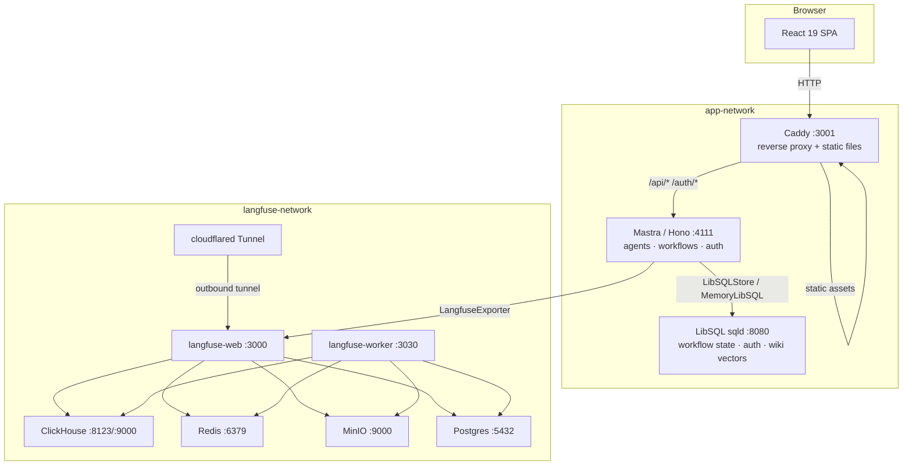

Triage is composed of ten Docker containers across two networks, all defined in a single `docker-compose.yml`. The system is designed around two principles: **single-origin** (Caddy reverse-proxies all traffic so the browser never makes cross-origin requests) and **Mastra as the HTTP server** (no Express, no separate API layer — Mastra runs directly on Hono).

## System Diagram



The `runtime` container joins both the `app` network (to reach `libsql`) and the `langfuse` network (to send traces to `langfuse-web`). All other containers are network-isolated to their respective network.

## The Ten Containers

| Container | Image | Port | Network | Role |
|-----------|-------|------|---------|------|
| `frontend` | Custom (Dockerfile.frontend) | 3001 | app | Caddy: serves static SPA, reverse-proxies `/api/*` and `/auth/*` to runtime |
| `runtime` | Custom (Dockerfile.runtime) | 4111 | app + langfuse | Mastra on Hono: agents, workflows, tools, Better Auth, webhooks |
| `libsql` | `ghcr.io/tursodatabase/libsql-server:v0.24.32` | 8080, 5001 | app | LibSQL (sqld): workflow state, auth sessions, wiki vectors, local ticket fallback |
| `langfuse-web` | `langfuse/langfuse:3.167.0` | 3000 | langfuse | Langfuse UI and API |
| `langfuse-worker` | `langfuse/langfuse-worker:3.167.0` | 3030 | langfuse | Langfuse background job processor |
| `clickhouse` | `clickhouse/clickhouse-server:24.8.9.95` | 8123, 9000 | langfuse | OLAP storage for trace events |
| `redis` | `redis:7.4-alpine` | 6379 | langfuse | Queue and cache for Langfuse worker |
| `minio` | `minio/minio:RELEASE.2025-09-07...` | 9000, 9001 | langfuse | S3-compatible object storage for media/exports |
| `langfuse-postgres` | `postgres:17.9-alpine` | 5432 | langfuse | Relational store for Langfuse metadata |
| `cloudflared` | `cloudflare/cloudflared:latest` | — | langfuse | Cloudflare Tunnel: exposes Langfuse at `https://langfuse.agenticengineering.lat` (outbound-only, no exposed ports) |

## Key Architectural Decisions

### Single-Origin Design

All browser traffic goes to Caddy on port 3001. Caddy serves the built React SPA for non-API paths and reverse-proxies `/api/*` and `/auth/*` to the runtime at `runtime:4111`. This eliminates CORS entirely — the browser always talks to the same origin.

### Mastra IS the HTTP Server

The runtime uses Mastra's built-in Hono server, not Express. Custom routes (auth, webhooks, wiki, Linear) are registered via `registerApiRoute()` in `runtime/src/mastra/index.ts`. If you need an external server for any reason, use Hono — never add Express as a dependency.

### LibSQL for Everything

A single LibSQL (sqld) instance serves four roles:
1. **Workflow state** — `LibSQLStore` persists Mastra workflow run snapshots, enabling workflow suspension and resumption across restarts
2. **Auth sessions** — Better Auth uses LibSQL for user accounts and sessions
3. **Wiki vectors** — `F32_BLOB(1536)` columns with DiskANN index enable native vector similarity search without a separate vector database
4. **Local ticket fallback** — When Linear is unavailable, tickets are written to a `local_tickets` table

### Graceful Degradation

Every external service has a fallback:
- Linear unavailable → tickets stored in `local_tickets` LibSQL table
- Resend down → email logged and skipped, triage continues
- OpenRouter primary model rate-limited → fallback chains tried automatically

### Dev vs Production Modes

In **dev mode** (`docker compose up`), `docker-compose.override.yml` is auto-loaded, enabling:
- Vite HMR (Hot Module Replacement) for the frontend
- `tsx --watch` for runtime TypeScript reloading

In **production mode** (`docker compose -f docker-compose.yml up`), the override is skipped:
- Static SPA is served directly by Caddy
- Runtime runs compiled JavaScript

## Dependency Chain

The startup order is enforced by healthcheck dependencies:

```
langfuse-postgres ──┐
clickhouse          ├──► langfuse-web ──► (ready) ──► cloudflared
redis               │
minio ──────────────┘

langfuse-postgres ──┐
clickhouse          ├──► langfuse-worker ──► (ready)
redis               │
minio ──────────────┘

libsql ──────────────► runtime ──────────────► frontend ──► (ready)
```

The `runtime` will not start until `libsql` passes its healthcheck. The `frontend` will not start until `runtime` passes its healthcheck (`GET /health`, 5 retries, 15s start period).
