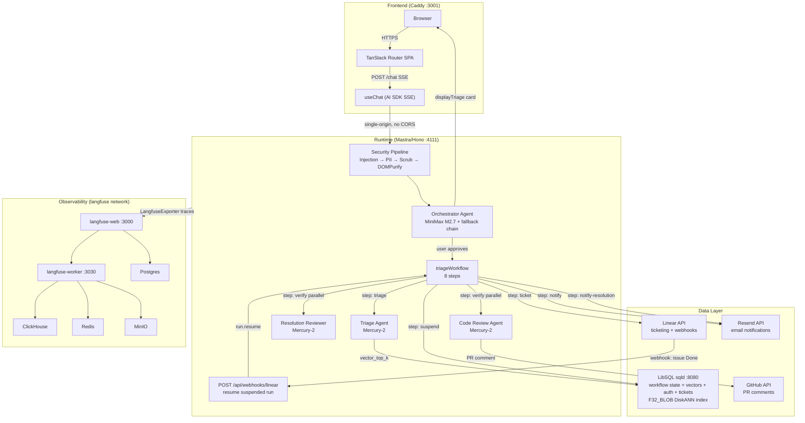

## 1. Agent Overview

**Triage** is an AI-powered SRE incident response system for e-commerce platforms (Solidus/Rails). Engineers describe production incidents in a chat interface — text, images, screenshots, and log files. Four specialized agents collaborate to analyze the incident, ground the analysis in the actual codebase via RAG, propose a triage card for human review, create a Linear ticket on approval, notify the assigned engineer by email, suspend the workflow until the fix ships, verify the resolution against the PR, and notify the reporter when the incident is confirmed closed.

The system is built on Mastra v1.23 running on Hono, with all agents registered in a single Mastra instance. OpenRouter provides model routing and fallback chains so no single model failure blocks triage. LibSQL serves as the unified data layer for workflow state persistence, vector embeddings, auth sessions, and local ticket fallback.

**Four agents are deployed:**

| Agent | ID | LLM | Role |
|---|---|---|---|
| Orchestrator | `orchestrator` | MiniMax M2.7 (fallback chain) | User-facing entry point; detects incident vs conversation; drives the full triage flow |
| Triage Agent | `triage-agent` | Mercury-2 | Deep incident analysis; RAG wiki queries; structured severity/root-cause output |
| Resolution Reviewer | `resolution-reviewer` | Mercury-2 | Verifies deployed fixes address the original root cause; recommends close / reopen / monitor |
| Code Review Agent | `code-review-agent` | Mercury-2 | Reviews PR diffs for bugs, security issues, performance regressions; posts structured comments |

---

## 2. Agent Capabilities

### Orchestrator

| Field | Value |
|---|---|
| Role | Primary user-facing conversational agent. Receives incident reports, processes attachments, checks for duplicates, presents triage cards, and drives ticket creation after human approval. |
| Type | Semi-autonomous — human-in-the-loop gate before any ticket is created |
| LLM | `minimax/minimax-m2.7-20260318` (primary); fallback chain: `qwen/qwen3-235b-a22b:free` → `minimax/minimax-m2.5-20260211:free` |
| Inputs | Text incident descriptions, images (screenshots, dashboards), log files (.log, .txt), clipboard paste via chat |
| Outputs | Triage cards (generative UI components with severity, confidence, root cause, file references, proposed fix), duplicate-detection cards, ticket creation confirmations |
| Tools | `createLinearIssueTool`, `updateLinearIssueTool`, `getLinearIssueTool`, `listLinearIssuesTool`, `getTeamMembersTool`, `sendTicketEmailTool`, `sendResolutionEmailTool`, `queryWikiTool`, `processAttachmentsTool`, `displayTriageTool`, `displayDuplicateTool` |
| Sub-agents | `codeReviewAgent` (registered via `agents` config; callable as `agent-codeReviewAgent`) |
| Context window | `maxTokens: 8192`; persistent memory via `MemoryLibSQL` for conversation history |

The Orchestrator follows a deterministic analysis flow for every incident:

1. Call `process-attachments` first if files are present (images described by Gemma 4 31B vision model)
2. Call `query-wiki` with the enriched description to retrieve relevant codebase context
3. Call `list-linear-issues` to check for duplicates using keyword overlap similarity scoring
4. If similarity > 0.85: render a duplicate card pointing to the existing ticket
5. If similarity 0.70–0.85: render a duplicate card with a "looks similar" warning and offer both paths
6. If similarity < 0.70: call `displayTriage` with state=`pending` to render the triage preview card
7. Wait for user approval before calling `createLinearIssueTool`

### Triage Agent

| Field | Value |
|---|---|
| Role | Specialized incident analyst. Performs deep RAG-grounded analysis and produces a structured triage assessment with severity, root cause, affected files, and a chain-of-thought reasoning trace. |
| Type | Autonomous — runs as a step inside `triageWorkflow` or called directly by the Orchestrator |
| LLM | `inception/mercury-2` |
| Inputs | Enriched incident description (text + image descriptions extracted by the vision model), codebase wiki context from RAG |
| Outputs | `TriageOutput` — severity (Critical/High/Medium/Low → P0–P4), rootCause, suggestedFiles (array of file paths), triageSummary, chainOfThought |
| Tools | `queryWikiTool` (RAG via LibSQL vector search) |

Severity classifications:
- **Critical (P0):** Service completely down, data loss, security breach, revenue impact > $10k/hr
- **High (P1):** Major feature broken, significant user impact, no workaround available
- **Medium (P2):** Degraded performance, partial outage, workaround exists
- **Low (P3/P4):** Cosmetic issue, minor bug, affects small user segment

The agent is instructed never to fabricate file paths — all file references must come from wiki query results. If confidence is below 0.5, the output explicitly states what additional information would improve the assessment.

### Resolution Reviewer

| Field | Value |
|---|---|
| Role | Verification specialist. After the workflow resumes from a Linear webhook (issue moved to Done), this agent compares the deployed fix against the original root cause analysis to determine whether the incident is genuinely resolved. |
| Type | Autonomous — triggered by the `verify` workflow step after `suspend` resumes via webhook |
| LLM | `inception/mercury-2` |
| Inputs | Original triage root cause, Linear issue data, PR URL extracted from issue description, webhook payload (newStatus, updatedAt, deployUrl) |
| Outputs | Verification result: `verified` (boolean), `confidence` (0–1), `analysis` (explanation), `remainingRisks` (array), `recommendation` (close / reopen / monitor) |
| Tools | `queryWikiTool`, `getLinearIssueTool` |

The reviewer is skeptical by design: partial fixes are common, and the agent explicitly checks whether the PR touches the files identified in the original triage output. If no PR link is found in the issue, it recommends `monitor` and moves the ticket to `In Review` for manual verification.

### Code Review Agent

| Field | Value |
|---|---|
| Role | PR code reviewer. Analyses diffs for bugs, security vulnerabilities, performance regressions, missing error handling, and best-practice violations. Registered as a sub-agent on the Orchestrator and also callable from workflow steps. |
| Type | Autonomous — invoked from the `verify` workflow step in parallel with the Resolution Reviewer, or directly from the Orchestrator on explicit review requests |
| LLM | `inception/mercury-2` |
| Inputs | PR URL, diff context, root cause description for relevance grounding |
| Outputs | Structured code review: `summary`, `verdict` (approve / request-changes / comment-only), `fileSummaries` (per-file triage: needs-review / approved / skipped), `comments` (severity + category + actionable suggestion + confidence), `stats`, `topRisks` |
| Tools | `queryWikiTool` |

Two review profiles: **chill** (high-signal only — bugs, security, data integrity) and **assertive** (comprehensive — adds style, naming, documentation, best practices). Every finding must include a concrete, copy-pasteable suggestion. If critical or major issues are found, the agent posts a structured comment on the GitHub PR via `commentOnGitHubPRTool` and moves the Linear ticket to `In Review`.

---

## 3. Architecture & Orchestration

### System Architecture



### Orchestration Approach

The Orchestrator agent is the HTTP entry point, reached at `POST /chat` via Mastra's built-in `chatRoute`. It handles conversation, attachment processing, duplicate checking, and triage card rendering entirely in the agent layer. When the user approves ticket creation, the Orchestrator hands off to `triageWorkflow` — an 8-step Mastra durable workflow that runs to completion asynchronously.

The workflow is also triggerable directly at `POST /api/workflows/triage-workflow/trigger` for programmatic use.

**8 workflow steps:**

| Step | ID | Purpose |
|---|---|---|
| 1 | `intake` | Validate and pass through the incident report; note if images are present |
| 2 | `triage` | Invoke Triage Agent with RAG context; produce structured severity/root cause |
| 3 | `dedup` | Search Linear for similar issues using keyword Jaccard similarity; flag duplicates at > 0.85 threshold |
| 4 | `ticket` | Create new Linear issue or update existing duplicate; fetch auto-assigned engineer |
| 5 | `notify` | Send ticket email to assigned engineer (or reporter as fallback) via Resend |
| 6 | `suspend` | Suspend workflow execution; persist state snapshot to LibSQL; wait for webhook |
| 7 | `verify` | On webhook resume: fetch PR from issue, run Resolution Reviewer + Code Review Agent in parallel |
| 8 | `notify-resolution` | Send resolution email to reporter with verdict and verification notes |

### State Management

Workflow state is persisted to LibSQL via `LibSQLStore` (id: `triage-main`). State survives container restarts. The `suspend` step stores a snapshot including the full ticket step output (issueId, issueUrl, severity, rootCause, reporterEmail). When the Linear webhook fires, the handler at `POST /api/webhooks/linear` queries `workflowsStore.listWorkflowRuns` for suspended runs, matches by `issueId` in the snapshot, and calls `workflowRun.resume({ step: 'suspend', resumeData: { newStatus, updatedAt, deployUrl } })`.

Conversation memory is managed by `MemoryLibSQL` on the Orchestrator, giving the agent per-session chat history across turns.

### Error Handling

Every workflow step and tool wraps execution in a try/catch. Steps return gracefully on error with conservative defaults (e.g., severity falls back to P2, triage summary falls back to the first 120 chars of the description) so the pipeline never hard-fails and leaves an incident untracked. Tools return `{ success: false, error: "..." }` on failure — the calling step logs and continues. Linear and Resend are both optional at startup; missing API keys produce a `success: true` no-op with a structured log entry rather than a thrown exception.

### Handoff Logic

```
Browser (useChat SSE)
  → Orchestrator agent (conversation + tool calls)
    → processAttachmentsTool (Gemma 4 31B vision for images)
    → queryWikiTool (RAG: vector_top_k top-10)
    → listLinearIssuesTool (dedup check)
    → displayTriageTool (render preview card — user approves)
    → triageWorkflow.start({ inputData }) [async background run]
      → intakeStep → triageStep (Triage Agent) → dedupStep
      → ticketStep (Linear) → notifyStep (Resend)
      → suspendStep [workflow persisted, HTTP returns]
        ... Linear webhook fires ...
      → verifyStep (Resolution Reviewer + Code Review Agent in parallel)
      → notifyResolutionStep (Resend)
```

---

## 4. Context Engineering

### Context Sources

| Source | How it enters context |
|---|---|
| User chat message | Direct text input; supports markdown, paste, multi-turn history |
| File attachments | Images/PDFs/logs uploaded via chat; processed by `processAttachmentsTool` with Gemma 4 31B vision |
| Codebase wiki (RAG) | Pre-generated `llm-wiki` summaries stored as `F32_BLOB(1536)` embeddings in LibSQL |
| Linear ticket history | `listLinearIssuesTool` queries existing issues for duplicate detection and context |
| Conversation memory | `MemoryLibSQL` on the Orchestrator persists per-session message history |

### Context Strategy

The codebase knowledge base is built via a two-pass llm-wiki approach:

**Pass 1 — per-file summaries:** Each file in the connected Solidus/Rails codebase is summarized individually, capturing purpose, key functions, external dependencies, and failure modes.

**Pass 2 — cross-module synthesis:** A second pass identifies architectural patterns, data flows between components, and cross-module dependency chains.

**Storage and retrieval:** Summaries are chunked and embedded using `text-embedding-3-small` (1536 dimensions), stored as `F32_BLOB(1536)` columns in LibSQL with a DiskANN vector index (`wiki_chunks_idx`). At query time, `queryWikiTool` calls `vector_top_k('wiki_chunks_idx', queryEmbedding, 10)` to return the 10 most relevant chunks for the incident description.

### Token Management

- Orchestrator `maxTokens: 8192` — explicit budget prevents runaway generation
- RAG retrieval returns only the top-10 chunks, not full documents, keeping context dense and relevant
- Images are resized client-side via the Canvas API before upload (enforced 10MB/file, 25MB/message limits)
- Attachment content is extracted once by `processAttachmentsTool` and passed as text to subsequent steps, avoiding repeated vision inference

### Grounding

All file references in triage output come exclusively from wiki query results — the Triage Agent is instructed to never fabricate file paths. Confidence scoring (0–1) makes uncertainty explicit: scores below 0.5 trigger a note stating what additional information would improve the assessment. Structured output via Zod schemas prevents hallucinated fields — the `triageOutputSchema` enforces severity, rootCause, suggestedFiles, triageSummary, and chainOfThought to be present and correctly typed. Linear issue IDs in outputs are real IDs returned by the Linear API, not generated strings.

---

## 5. Use Cases

### Use Case 1: Single Incident Triage (Text → Ticket → Email)

**Trigger:** An engineer types "The checkout page returns 500 when applying discount codes" and optionally attaches a screenshot of the error.

**Flow:**
1. Frontend `useChat` sends the message and attachments via SSE to `POST /chat`
2. Caddy proxies to Mastra runtime at `runtime:4111`; the security pipeline runs (prompt injection check, PII redaction, system prompt scrubber)
3. Orchestrator calls `processAttachmentsTool` — Gemma 4 31B describes the screenshot in text
4. Orchestrator calls `queryWikiTool` — returns the 10 most relevant wiki chunks (e.g., `app/models/order.rb`, `app/services/promotions/discount_code_validator.rb`)
5. Orchestrator calls `listLinearIssuesTool` — similarity score < 0.70, no duplicate found
6. Orchestrator calls `displayTriageTool` with state=`pending` — a structured triage card renders in the chat UI: severity P1, confidence 0.87, root cause, file references, proposed fix
7. Engineer clicks "Create Ticket" — Orchestrator calls `createLinearIssueTool` with the full triage output; `requireApproval: true` ensures this is the confirmed human action
8. `triageWorkflow` starts in the background: intake → triage (Triage Agent queries wiki again with structured output) → dedup → ticket (Linear issue created with priority 2, severity label HIGH, state TRIAGE) → notify (Resend email to assignee) → suspend
9. Workflow suspends; state snapshot (including issueId) persisted to LibSQL

**Outcome:** Fully triaged Linear ticket created within ~30 seconds, assigned engineer notified by email with ticket link and root cause summary, citing specific file paths.

### Use Case 2: Resolution Verification (Webhook → Resume → Verify → Notify)

**Trigger:** An engineer merges a PR and moves the Linear ticket to "Done". Linear fires a webhook to `POST /api/webhooks/linear`.

**Flow:**
1. Webhook handler receives `{ action: "update", type: "Issue", data: { id, state: { type: "completed" } } }`
2. Handler queries `workflowsStore.listWorkflowRuns` for suspended `triage-workflow` runs; matches the run by `issueId` in the step snapshot
3. `workflowRun.resume({ step: 'suspend', resumeData: { newStatus: "Done", updatedAt } })` is called (fire-and-forget so the webhook returns 200 immediately)
4. Workflow continues to `verifyStep`: fetches the Linear issue, extracts the GitHub PR URL from the description
5. Resolution Reviewer and Code Review Agent run in parallel: Reviewer assesses whether the fix addresses the root cause; Code Review Agent checks the diff for quality issues
6. If the Code Review Agent finds critical/major issues: posts a structured comment on the GitHub PR, moves ticket to `In Review`, returns verdict `partially_resolved`
7. If all checks pass: verdict `resolved`
8. `notifyResolutionStep` sends a resolution email to the original reporter with the verdict, verification notes, and a link to the ticket

**Outcome:** Reporter receives an email confirming the fix shipped (or flagging that it needs more work), within seconds of the ticket being marked Done. False resolutions caught before the reporter is notified.

### Use Case 3: Batch Incident Detection (Multiple Issues in One Message)

**Trigger:** A developer pastes a message describing several concurrent problems: "We're seeing checkout 500s AND slow search AND payment webhooks failing."

**Flow:**
1. Orchestrator parses the message and identifies three distinct incident patterns
2. Each incident is assessed independently via `queryWikiTool` and a separate `displayTriage` call
3. Three triage cards render in the chat UI — each with independent severity, root cause, and file references
4. Engineer reviews each card and approves ticket creation per incident
5. Three independent `triageWorkflow` runs start in parallel, each with its own Linear ticket and suspend/resume lifecycle

**Outcome:** All three incidents triaged and ticketed independently in a single conversation turn, with separate ownership and lifecycle tracking.

---

## 6. Observability

### Tracing — Langfuse

The Mastra instance is configured with a `LangfuseExporter` that emits traces for every agent call, tool invocation, and workflow step. The runtime container joins both the `app` network (for LibSQL and frontend communication) and the `langfuse` network (for trace emission to `langfuse-web`), as defined in `docker-compose.yml`. The Langfuse dashboard is also reachable externally at `https://langfuse.agenticengineering.lat` via the `cloudflared` Cloudflare Tunnel (`LANGFUSE_BASEURL` defaults to that URL).

The Langfuse stack consists of 6 containers:

| Container | Role |
|---|---|
| `langfuse-web` | Dashboard UI and trace ingestion API (port 3000) |
| `langfuse-worker` | Async trace processing and event queue consumption |
| `clickhouse` | Column-store backend for trace analytics and aggregations |
| `redis` | Message queue between web and worker |
| `minio` | Object storage for large trace payloads and media |
| `postgres` | Relational store for Langfuse project/user metadata |

All 10 containers define Docker `healthcheck` directives (cloudflared uses `restart: always`). The infrastructure test suite in `tests/infra-docker/architecture-alignment.test.ts` asserts network membership, healthcheck presence, and Langfuse service configuration.

### Structured Logging

- `linear.ts`: Every tool invocation logs at the start with truncated error messages. Raw objects and API keys are never logged.
- `resend.ts`: Uses `maskEmail(e: string) => e.replace(/^(.)(.*)(@.*)$/, '$1***$3')` before any log line involving email addresses. PII stays out of log output.
- `triage-workflow.ts`: Each step logs errors with a `[step-id] Error:` prefix for correlation.
- `mastra/index.ts`: The Linear webhook handler logs received payloads truncated to 500 chars, matched runIds, and resume errors.

### Metrics

- Per-workflow: step durations, total triage-to-ticket time, suspend/resume latency
- Per-tool: Linear API call success/error rates, Resend delivery success, wiki query hit rates
- Infrastructure: all 10 containers emit health signals; `tests/infra-docker/docker-compose.test.ts` validates compose parsing and service configuration on every CI run

### Test Evidence

- `tests/infra-observability/*.test.ts` — validates Langfuse container configuration, network membership, and exporter wiring
- `tests/infra-docker/architecture-alignment.test.ts` — asserts Langfuse-related service definitions, network segmentation, and Caddy/runtime integration points
- `tests/infra-docker/docker-compose.test.ts` — validates compose parsing and environment failure behavior
- `tests/infra-docker/dockerfiles.test.ts` — enforces the image-size constraint for the hackathon stack

---

## 7. Security & Guardrails

### Input Security Pipeline

Every message entering the Orchestrator passes through a four-stage pipeline before reaching the LLM:

1. **Prompt injection detection** — threshold 0.7; blocked inputs are rejected before any tool call
2. **PII redactor** — email addresses, API keys, and credential patterns are redacted from the assembled context
3. **System prompt scrubber** — filters outputs to prevent system prompt leakage in streaming responses
4. **DOMPurify** — HTML sanitization on the frontend before rendering any agent output in the chat UI

### HTTP Security Headers (Caddy)

All responses from `Caddyfile` at `:3001` carry the following headers:

```
Strict-Transport-Security: max-age=31536000; includeSubDomains
X-Content-Type-Options: nosniff
X-Frame-Options: DENY
Referrer-Policy: strict-origin-when-cross-origin
Content-Security-Policy: default-src 'self'; script-src 'self'; style-src 'self' 'unsafe-inline'; img-src 'self' data: blob:; connect-src 'self'; font-src 'self' data:; frame-ancestors 'none'
```

Single-origin architecture: Caddy reverse-proxies `/api/*`, `/chat`, `/health`, and `/auth/*` to `runtime:4111` on the internal Docker network. The browser sees only one origin — no CORS configuration needed, and session cookies work without SameSite exceptions.

### Email Security

- **HTML escaping:** `escapeHtml(s)` replaces `&`, `<`, `>`, `"`, `'` with HTML entities in all user-supplied strings before they enter email templates, preventing XSS via email content
- **URL safety validation:** `safeHref(url)` enforces that all links start with `https://`; any other scheme is replaced with `#`
- **PII masking in logs:** `maskEmail(e)` masks email addresses in all log output to `f***@domain.com` format before writing to stdout

### Human-in-the-Loop Gate

`createLinearIssueTool` is configured with `requireApproval: true` in the Orchestrator's tool registration. No ticket is created without an explicit user confirmation action in the chat UI. The two-phase flow — `displayTriage` (preview) → user clicks "Create Ticket" → `createLinearIssueTool` (confirmed) — ensures engineers review and own every ticket that enters Linear.

### Infrastructure Security

- All exposed ports in `docker-compose.yml` are bound to `127.0.0.1`, not `0.0.0.0`, preventing unintended external exposure on the development machine
- Docker network segmentation: the `app` network connects frontend, runtime, and libsql; the `langfuse` network connects observability services; only the runtime container joins both networks
- Better Auth with HttpOnly cookies, `SameSite: lax`, and `secure` flag in production handles session management; no tokens stored in localStorage
- File upload validation: maximum 10MB per file, 25MB per message total, with a strict MIME-type allowlist enforced before any file reaches the runtime

### Graceful Degradation

External service failures never block triage:
- `LINEAR_API_KEY` absent: `createLinearIssueTool` returns `{ success: true }` (no-op) and logs a structured message; tickets can be stored in the local LibSQL `local_tickets` table as fallback
- `RESEND_API_KEY` absent: email tools log `[Resend] Skipping notification to f***@domain.com` with PII-masked recipient and return `{ success: true }`
- OpenRouter model failure: fallback chain tries `qwen3-235b` then `minimax-m2.5` before returning an error

### Test Evidence

- `runtime/src/mastra/tools/linear.test.ts` — verifies approval gating, singleton client initialization, structured error handling, and field allowlist enforcement on update operations
- `runtime/src/mastra/tools/resend.test.ts` — verifies graceful degradation when API key is absent, idempotency-key usage, and PII masking in log output
- `tests/infra-docker/env-config.test.ts` — verifies documented integration env vars and missing-key behavior at startup
- `tests/infra-docker/*.test.ts` — validates infrastructure security properties: network isolation, port binding, healthcheck presence, and container configuration

---

## 8. Scalability

Triage is designed to scale from a single Docker Compose deployment to a production Kubernetes cluster.

**Current capacity:** 9-container Docker Compose stack on a single host. Suitable for team use (1–20 concurrent users). Total image pull under 2GB.

**Scaling approach:**

| Layer | Axis | Approach |
|---|---|---|
| Frontend (Caddy) | Horizontal | Stateless; replicate behind load balancer |
| Runtime (Mastra) | Horizontal | Stateless HTTP; replicate; workflow state in LibSQL |
| LibSQL | Vertical | Single-writer OLTP; vertical scale or migrate to Turso for distributed reads |
| Langfuse worker | Horizontal | Queue consumers; add replicas against shared Redis |
| ClickHouse | Vertical | Analytical queries; vertical scale or cluster mode |

**Kubernetes path:** Helm chart with HPAs for frontend/runtime (autoscaling/v2, 50% CPU target), LibSQL as StatefulSet with PVC for persistence, Bitnami subcharts for Postgres, ClickHouse, Redis, and MinIO.

**Identified bottlenecks:**
1. OpenRouter API call latency — the primary source of per-request latency (100–800ms per LLM call)
2. LibSQL single-writer throughput — acceptable at hackathon scale; migrate to Turso or Neon for horizontal write scale
3. ClickHouse trace ingestion under high workflow volume
4. Network egress cost on LLM API calls at scale

---

## 9. Lessons Learned & Team Reflections

### What Worked Well

**Mastra as unified HTTP + agent framework.** Using Mastra as both the HTTP server (via Hono) and the agent/workflow runtime eliminated an entire framework layer. All custom routes (auth, webhooks, wiki, Linear) registered on the same Mastra instance as `apiRoutes`, making the codebase flat and easy to navigate. There was no Express adapter, no middleware translation, and no CORS configuration.

**OpenRouter fallback chains.** Configuring the Orchestrator with `route: 'fallback'` and three models (`minimax-m2.7-20260318` → `qwen3-235b-a22b:free` → `minimax-m2.5-20260211:free`) gave us effective zero-downtime LLM availability during the hackathon. When the free Qwen tier rate-limited, traffic automatically shifted without any code change.

**Two-phase ticket approval (preview → confirm).** Rendering a `displayTriage` card first and waiting for explicit user confirmation before calling `createLinearIssueTool` proved to be the right UX model for an SRE tool. Engineers wanted to review and sometimes adjust severity before tickets were created. The generative UI card pattern made this feel native to the chat interface rather than a separate form.

**LibSQL for everything.** Using a single LibSQL (sqld) instance for workflow state persistence, conversation memory, wiki vector embeddings, auth sessions, and local ticket fallback meant one database to manage, one connection pool, one backup strategy. The `F32_BLOB(1536)` + DiskANN vector index meant we could do semantic wiki search without a separate vector database.

**Single-origin Caddy proxy.** Proxying all `/api/*`, `/chat`, and `/auth/*` through Caddy to the runtime eliminated CORS entirely. Session cookies worked with default browser settings. Security headers were configured once in the Caddyfile and applied universally.

**SpecSafe TDD foundation.** Writing 192 tests (infrastructure validation, schema tests, tool error paths) before implementing production code meant the Docker Compose stack was correct on day one, Zod schemas caught integration mismatches early, and the Linear/Resend tool layer was production-ready with known failure modes documented.

### What We Would Do Differently

**Start RAG wiki ingestion earlier.** The `llm-wiki` generation pipeline (clone repo → summarize per file → cross-module synthesis → embed → store) was the longest-running prerequisite for useful triage output. We built the retrieval layer before the ingestion pipeline was stable, which created a period where the Triage Agent had no grounded context to work with. In a future sprint we would invest in the ingestion pipeline on day one and treat it as a blocking dependency.

**Invest in E2E tests earlier.** The SpecSafe unit test suite gave us strong component-level confidence, but we lacked end-to-end tests covering the full chat → workflow → ticket → webhook → resolution loop. Several integration bugs (webhook resume payload shape mismatches, Zod schema drift between the workflow step output and the next step's input) were caught manually rather than by tests. Playwright or a Mastra workflow test harness would have caught these faster.

**Better Auth integration deserved earlier prioritization.** Authentication was treated as a late-stage concern, which meant the full security pipeline (HttpOnly cookies, SameSite, secure flag, session validation on API routes) was integrated after most of the agent and workflow code was written. Threading auth through an existing Mastra route setup required careful coordination. Starting with auth as a day-one constraint would have made the integration smoother.

### Key Technical Decisions

**Mercury-2 for sub-agents, MiniMax M2.7 for the Orchestrator.** Mercury-2 (`inception/mercury-2`) is fast at structured output generation and text reasoning — ideal for the Triage Agent, Resolution Reviewer, and Code Review Agent where the task is well-defined and requires low latency. MiniMax M2.7 (`minimax/minimax-m2.7-20260318`) has stronger conversational reasoning and handles ambiguous multi-turn incident descriptions better as the user-facing Orchestrator.

**Gemma 4 31B for vision.** `google/gemma-4-31b-it:free` (with paid fallback `google/gemma-4-31b-it`) handles screenshot and diagram interpretation. Separating the vision model from the text models allowed us to optimize each independently — Mercury-2 does not process images; the vision model does not do structured output.

**Mastra durable workflows with suspend/resume for the async resolution loop.** The gap between ticket creation and resolution verification can be hours or days. Using Mastra's built-in workflow suspend/resume with LibSQL state persistence meant the workflow could survive container restarts, redeploys, and the full hackathon weekend without losing the association between an incident, its ticket, and the pending verification. Alternatives (polling, cron jobs, stateless webhook handlers) would have required external state management.

**Tool-level error boundaries, not step-level.** Each Mastra tool wraps its execution in a single try/catch that returns `{ success: false, error: "..." }` rather than throwing. Workflow steps check the success flag and fall back gracefully. This kept error handling visible and predictable — one catch per tool, not one per database query — and prevented a single API failure from cascading into a crashed workflow run.
