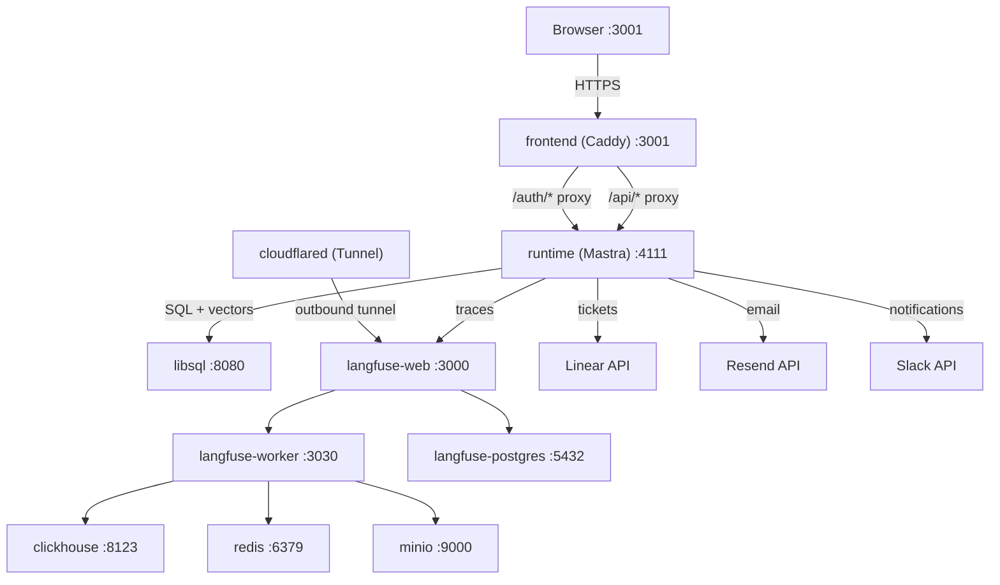

# Triage — AI-Powered SRE Incident Triage Agent

AI agent that triages SRE incidents for Solidus/Rails e-commerce: describe the incident, get a root-cause analysis, a Linear ticket, and email + Slack notifications — all in one chat session.

> **Demo video:** _coming soon_ — #AgentXHackathon
> _Last updated: 2026-04-10_

## What Is Triage?

Triage is an AI-powered incident intake and triage system for on-call SRE engineers working on real e-commerce codebases. Our demo target is [**Solidus**](https://github.com/solidusio/solidus) — a large public Rails e-commerce monorepo. Instead of manually hunting through logs, code, and runbooks under pressure, an engineer describes the incident in plain text (with optional screenshots), and Triage does the rest.

The orchestrator agent queries a real codebase knowledge base via LibSQL vector search (Wiki/RAG pipeline indexing Solidus: **2,363 documents / 3,740 chunks / 1536-dim embeddings**), identifies the root cause with specific file references, scores severity and confidence, and produces a structured TriageCard. The engineer approves it and the agent creates a Linear ticket (SOL team), sends email and Slack notifications to the assignee, and then suspends — waiting for a Linear webhook when the fix ships. When the ticket moves to "In Review", the **evidence-check flow** queries Linear comments and GitHub (commits / branches / PRs referencing the Linear identifier) to decide whether the ticket can advance to Done or should be bounced back to In Progress. When Done, the original reporter is notified.

Teams can connect any Git repository through the **Projects UI** (`/projects`) — the system clones, chunks, embeds, and indexes the codebase into the Wiki/RAG vector store.

The full system runs on a single `docker compose up --build` from a clean clone. Ten containers start behind a Caddy reverse proxy that eliminates CORS and handles all security headers. Observability is provided by a self-hosted Langfuse stack with full LLM traces, token cost tracking, and latency metrics — fed by **OpenRouter's workspace-level Broadcast feature** (zero runtime SDK code). Langfuse is published via a Cloudflare Tunnel at `https://langfuse.agenticengineering.lat` for ingestion; for the demo the sidebar "Observability" link points at `http://localhost:3000` because the tunnel rewrites the Host header and breaks Auth.js interactive login.

## Architecture




- **10 containers** on 2 Docker networks (`app` + `langfuse`), all with healthchecks and `depends_on: service_healthy`
- **Single-origin Caddy reverse proxy** — serves the SPA and proxies `/api/*` and `/auth/*` to the runtime; no CORS required
- **Mastra durable workflow runtime** — agents, workflows, tools, and Better Auth session handling on a single Hono server
- **LibSQL with F32_BLOB(1536) vector search** — DiskANN index for codebase wiki RAG; also serves workflow state, auth, and fallback ticket storage

## Quick Start

```bash
# 1. Clone the repository
git clone https://github.com/Agentic-Engineering-Agency/triage.git
cd triage

# 2. Configure environment
cp .env.example .env
# Edit .env — fill in the four mandatory vars at minimum (see below)

# 3. Start all services
docker compose up --build
```

Open [http://localhost:3001](http://localhost:3001) for the chat UI.
Open [http://localhost:3000](http://localhost:3000) for the Langfuse observability dashboard.

**Mandatory environment variables:**

| Variable | Purpose |
|----------|---------|
| `OPENROUTER_API_KEY` | LLM access via OpenRouter |
| `LINEAR_API_KEY` | Linear ticket creation |
| `RESEND_API_KEY` | Email notifications |
| `BETTER_AUTH_SECRET` | Session signing (any 32+ char random string) |

**Recommended (for full notification support):**

| Variable | Purpose |
|----------|---------|
| `SLACK_BOT_TOKEN` | Slack notifications via Bot User OAuth Token |
| `SLACK_CHANNEL_ID` | Default Slack channel for incident alerts |

See `.env.example` for all 58 documented variables. See the [Quick Guide](/docs/hackathon/quick-guide) for detailed setup and troubleshooting.

## Tech Stack

| Layer | Technology | Purpose |
|-------|-----------|---------|
| Agent Framework | Mastra v1.24 | Multi-agent orchestration, durable workflows, tool system |
| Database | LibSQL (sqld) | App data, vector embeddings (F32_BLOB + DiskANN), workflow state |
| ORM | Drizzle | Type-safe SQL, schema management, migrations |
| Auth | Better Auth | Session-based auth with HttpOnly cookies |
| Observability | Langfuse v3 | LLM traces, token cost tracking, latency metrics |
| LLM Gateway | OpenRouter | Multimodal LLM access with 3-model fallback routing |
| Frontend | TanStack Router + React | File-based SPA routing with lazy loading |
| AI UI | AI SDK + AI SDK Elements | Chat streaming (SSE), generative UI components |
| Reverse Proxy | Caddy v2 | Single-origin architecture, security headers, SSE support |
| UI Components | shadcn/ui | Radix-based accessible component library |
| Ticketing | Linear SDK | Issue creation, assignment, status tracking, webhooks |
| Email | Resend | Transactional email notifications |
| Chat Notifications | Slack Web API | Ticket and resolution notifications with Block Kit formatting |
| Wiki/RAG | @mastra/rag + LibSQL vectors | Codebase cloning, chunking, embedding, and semantic search |

## Agents

| Agent | Model | Role |
|-------|-------|------|
| **Orchestrator** | `qwen/qwen3.6-plus` via OpenRouter | User-facing conversational agent; attachment handling, wiki RAG queries, duplicate detection, triage card rendering, Linear ticket creation (human-approved) |
| **Triage Agent** | `inception/mercury-2` via OpenRouter | Deep structured triage; RAG grounding, severity scoring, root-cause analysis, file references |
| **Resolution Reviewer** | `inception/mercury-2` via OpenRouter | Fix verification; PR/commit analysis against original root cause |
| **Code Review Agent** | `inception/mercury-2` (chill/assertive profiles) | Diff-level code review inside the triage workflow |

Embeddings for the wiki RAG pipeline use `openai/text-embedding-3-small` (1536 dimensions) via OpenRouter.

## Demo Journey (Evidence)

| Step | Screenshot |
|---|---|
| Authenticated chat landing |  |
| Solidus project wiki-indexed (2363 docs / 3740 chunks) |  |
| Orchestrator explains its capabilities |  |
| Incident reported → triage card → Linear SOL-4 created |  |
| Kanban board (live from Linear) with SOL-4 assigned to Lalo |  |

## Documentation

| Document | Description |
|----------|-------------|
| [Agents & Implementation](/docs/hackathon/agents-use) | Agent implementation, architecture, observability, security |
| [Scaling](/docs/hackathon/scaling) | Docker → Kubernetes migration path, cost projections |
| [Quick Guide](/docs/hackathon/quick-guide) | Setup, verification, and troubleshooting |
| [Live deployment](https://triage.agenticengineering.lat) | Hosted demo instance |

## Team

| Name | Role | Focus |
|------|------|-------|
| **Lalo** | Lead & Agents | Workflow orchestration, agent design, Linear integration |
| **Fernando** | Infrastructure | Docker Compose, K8s scaffolding, CI/CD, SpecSafe pipeline |
| **Koki** | Runtime & Integrations | Mastra setup, wiki pipeline, security processors, Resend |
| **Chenko** | Frontend | TanStack SPA, chat UI, auth flow |

Built for the AgentX Hackathon 2026.
