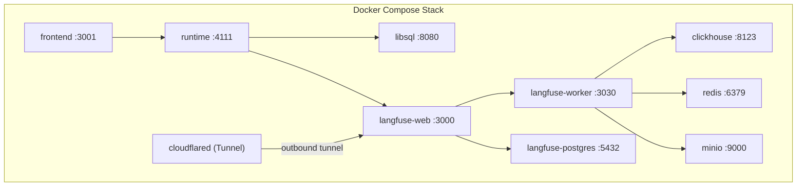
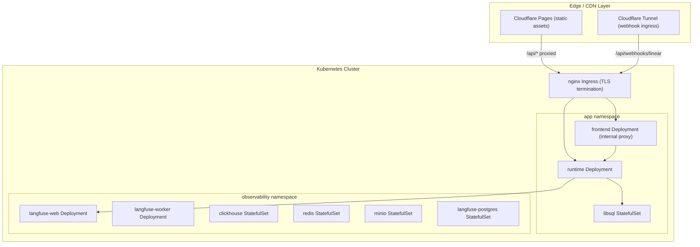

## Single-Host Capacity (Docker Compose)

Before Kubernetes is needed, the Docker Compose stack handles the following load on a single host (estimated from LibSQL write throughput and LLM API latency):

| Metric | Estimate | Bottleneck |
|--------|----------|------------|
| Concurrent users | ~50 | Runtime HTTP thread pool |
| Incidents per day | ~200 | LibSQL single-writer + LLM round-trip |
| Triage latency (p50) | ~8–12s | OpenRouter API call chain |
| Triage latency (p95) | ~25s | LLM queue depth at peak |
| Wiki RAG queries/day | ~1,000 | LibSQL DiskANN vector search |

**When to migrate to Kubernetes:** sustained >40 concurrent users, >150 incidents/day, or when you need zero-downtime deploys and multi-replica HA. Below that threshold, the Docker Compose stack is operationally simpler and sufficient.

## Current Architecture: Docker Compose

All 10 services run as containers orchestrated by Docker Compose.



## Kubernetes Migration Path

For production, we migrate to Kubernetes with Helm charts.



## Webhook Ingress at Scale

Linear webhooks require a stable, publicly reachable HTTPS endpoint. In production:

1. **Cloudflare Tunnel (recommended for early prod)** — run `cloudflared` as a Kubernetes Deployment. Creates an outbound-only tunnel from the cluster to Cloudflare's edge. No static IP needed, no firewall holes, free tier available. Maps `https://triage.example.com/api/webhooks/linear` → `runtime:4111/api/webhooks/linear`.

2. **nginx Ingress + static IP (K8s standard)** — assign a LoadBalancer service with a static external IP. Ingress terminates TLS via cert-manager (Let's Encrypt). Route `/api/webhooks/*` directly to the runtime Service. This is the default path in `k8s/helm/values.yaml` (`ingress.className: nginx`).

3. **ngrok / Cloudflare Tunnel in dev** — for local development and hackathon demos, run `cloudflared tunnel --url http://localhost:4111` or `ngrok http 4111` and register the resulting URL in Linear's webhook settings.

The runtime webhook handler at `POST /api/webhooks/linear` verifies the `linear-signature` header (HMAC-SHA256) before processing. This signature check is the primary security control for the public-facing webhook endpoint.

## CDN and Static Asset Delivery

At scale, the Caddy static file server becomes a bottleneck for frontend asset delivery. The production topology moves static assets to the edge:

- **Cloudflare Pages** serves the compiled Vite SPA (`dist/`) via Cloudflare's global CDN. Build artifacts are deployed automatically on merge to `main`.
- **Caddy / nginx Ingress** becomes an internal proxy only, forwarding `/api/*` and `/auth/*` to the runtime. It no longer serves HTML/JS/CSS.
- **Cache headers:** Immutable assets (`/assets/*.js`, `/assets/*.css`) get `Cache-Control: public, max-age=31536000, immutable`. `index.html` gets `Cache-Control: no-cache` to ensure SPA routing picks up new deploys.

This eliminates the frontend container as a scaling concern — CDN handles all static traffic regardless of incident volume.

## Per-Service Scaling Table

| Service | Scaling Strategy | Replicas (Dev) | Replicas (Prod) | Notes |
|---------|-----------------|----------------|-----------------|-------|
| frontend | Horizontal | 1 | 2–4 | Stateless; CDN offloads static at scale |
| runtime | Horizontal | 1 | 3–6 | Stateless, CPU-bound |
| libsql | Vertical | 1 | 1 | Single-writer |
| langfuse-web | Horizontal | 1 | 2–3 | Stateless |
| langfuse-worker | Horizontal | 1 | 3–5 | Queue consumers |
| clickhouse | Vertical | 1 | 1–3 | Sharding for scale |
| redis | Vertical | 1 | 1 | Sentinel for HA |
| minio | Horizontal | 1 | 4+ | Erasure coding |
| langfuse-postgres | Vertical | 1 | 1 | Read replicas |

## HPA Autoscaling Specs (autoscaling/v2)

HPA is enabled for `frontend` and `runtime` in `k8s/helm/values.yaml`. The target CPU utilization is **50%** — chosen to leave headroom for LLM response bursts without triggering scale-down oscillation.

```yaml
# frontend HPA
apiVersion: autoscaling/v2
kind: HorizontalPodAutoscaler
spec:
  minReplicas: 1        # values.yaml: frontend.autoscaling.minReplicas
  maxReplicas: 5        # values.yaml: frontend.autoscaling.maxReplicas
  metrics:
    - type: Resource
      resource:
        name: cpu
        target:
          type: Utilization
          averageUtilization: 50
  # Resource envelope per pod: request 500m CPU / 512Mi RAM, limit 2 CPU / 2Gi RAM
```

```yaml
# runtime HPA
apiVersion: autoscaling/v2
kind: HorizontalPodAutoscaler
spec:
  minReplicas: 1        # values.yaml: runtime.autoscaling.minReplicas
  maxReplicas: 5        # values.yaml: runtime.autoscaling.maxReplicas
  metrics:
    - type: Resource
      resource:
        name: cpu
        target:
          type: Utilization
          averageUtilization: 50
  # Resource envelope per pod: request 1 CPU / 1Gi RAM, limit 2 CPU / 4Gi RAM
```

`langfuse-web` and `langfuse-worker` do not have HPA configured in the current Helm chart; they are scaled manually via `replicaCount` overrides. Add HPA for `langfuse-worker` when trace ingest volume exceeds Redis queue depth SLOs.

## Bottleneck Analysis

Key bottlenecks identified:

1. **Runtime ↔ LLM latency** — OpenRouter API calls are the primary bottleneck. Mitigate with request batching and caching.
2. **LibSQL write throughput** — Single-writer architecture limits write scaling. Consider sharding or migration to distributed SQL.
3. **ClickHouse ingestion** — High trace volume can saturate ingestion. Buffer via Redis queues.
4. **Network egress** — LLM API calls generate significant outbound traffic.

## Cost Projection

| Scale Tier | Incidents/day | Infra Cost/mo | LLM Cost/mo | Email Cost/mo | Total/mo |
|-----------|---------------|---------------|-------------|---------------|----------|
| Dev | fewer than 10 | $0 (local) | ~$5 | $0 (Resend free) | ~$5 |
| Seed | ~10 | ~$150 | ~$55 | $0 (Resend free) | ~$205 |
| Growth | ~50 | ~$500 | ~$275 | ~$10 | ~$785 |
| Scale | ~200 | ~$1,800 | ~$1,100 | ~$40 | ~$2,940 |
| Enterprise | 1,000+ | ~$3,000 | ~$5,500 | ~$200 | ~$8,700 |

**Cost assumptions:**
- Average tokens per triage: ~2,000 input + ~1,000 output = ~3,000 tokens total
- Model mix: Mercury-2 (~$0.60/1M tokens) for fast triage classification; MiniMax M2.7 (~$2/1M tokens) for root-cause reasoning and resolution review. Blended effective rate used in projections: ~$0.92/1M tokens
- LLM cost formula: `incidents/day × 30 days × 3,000 tokens × blended_rate`
- Email: Resend free tier covers 100 emails/day (3,000/mo). Paid plan at $20/mo covers 50,000/mo — sufficient through Growth tier
- Infra: Docker Compose on a single VPS at Seed; managed Kubernetes (EKS/GKE) from Growth onward
- These are estimates; actual costs vary with model selection, retry rates, and image attachment token overhead

## Scaling Triggers Summary

| Trigger | Action |
|---------|--------|
| >40 concurrent users | Migrate to Kubernetes |
| >150 incidents/day | Migrate to Kubernetes + add libsql read replicas |
| >200 incidents/day | Enable CDN (Cloudflare Pages), tune HPA |
| >500 incidents/day | Evaluate libsql → distributed SQL (PlanetScale / Turso multi-tenant) |
| Linear webhook reliability issues | Switch to Cloudflare Tunnel from static IP ingress |
