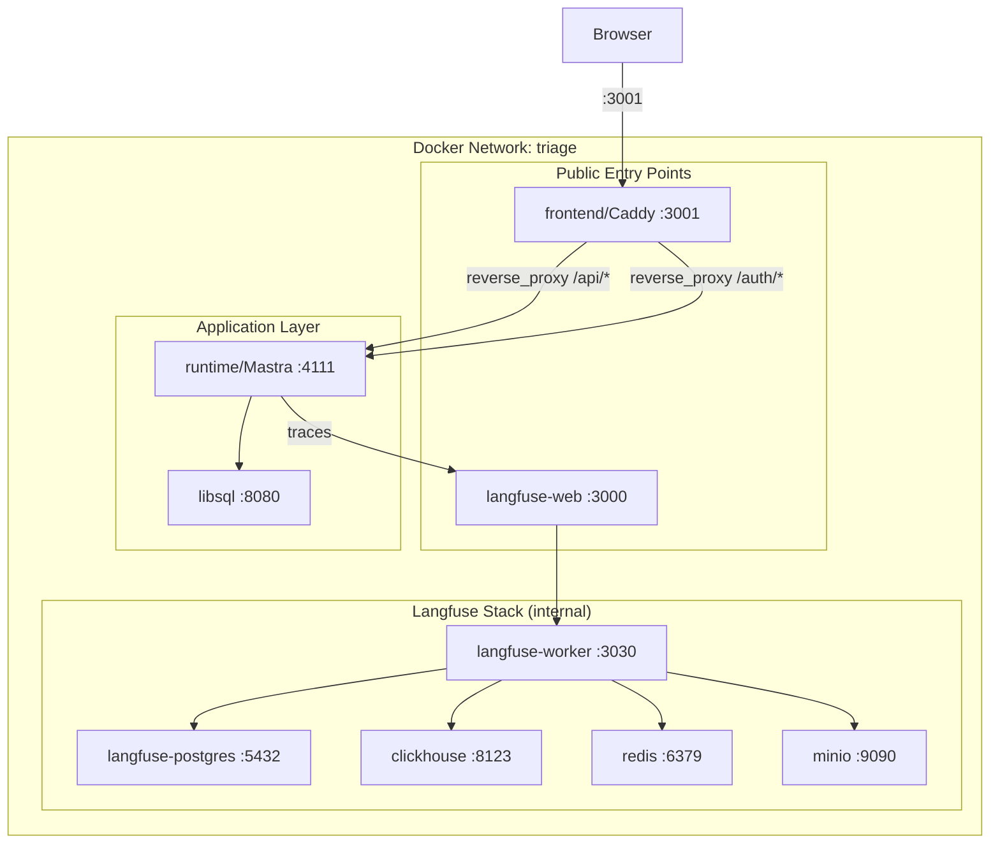

# SPEC-20260407-001: Infrastructure Docker K8s Init

**ID:** SPEC-20260407-001
**Name:** infra-docker-k8s-init
**Stage:** CODE
**Created:** 2026-04-07
**Updated:** 2026-04-07
**Author:** Lucy (infra)

## Purpose

Establish the complete infrastructure foundation for Triage — an AI-powered SRE agent — so that the entire application runs via a single `docker compose up --build` command from a clean state. This spec covers three pillars: (1) Docker Compose orchestration of 9 containers with health checks, dependency ordering, secure defaults, and a Caddy-based single-origin frontend architecture; (2) Kubernetes Helm chart scaffolding demonstrating a scaling path; (3) professional hackathon documentation with Mermaid/Excalidraw diagrams, required for evaluation across Reliability, Observability, Scalability, Context Engineering, Security, and Documentation criteria.

## Scope

### In Scope

- Docker Compose file with 9 service definitions, health checks, dependency ordering, named volumes, and a single network
- Custom two-stage Dockerfiles for `runtime` (Mastra) and `frontend` (Caddy serving static + reverse proxy)
- Caddyfile configuration for single-origin architecture: SPA routing, API/auth reverse proxy to runtime, SSE streaming support
- `.env.example` with all environment variables, grouped and commented, with CHANGEME placeholders for secrets
- Kubernetes Helm chart scaffolding under `k8s/helm/` with 14 templates, Chart.yaml, and values files
- HPA definitions for horizontally scalable services
- Documentation with professional Mermaid diagrams and Excalidraw visual assets: README.md, AGENTS_USE.md, SCALING.md, QUICKGUIDE.md, LICENSE (MIT)
- ARM64 compatibility handling (platform pinning for libsql)
- Network security: internal services bound to 127.0.0.1, Caddy as single public entry point
- Graceful degradation: mock/fallback modes for Linear, Resend, and LLM when API keys are missing
- Total Docker image pull size constraint (≤2GB for complete stack)

### Out of Scope

- Application code (agents, tools, workflows, RAG pipelines)
- Database migrations and seed data
- CI/CD pipelines (GitHub Actions, etc.)
- Production Kubernetes deployment or managed service provisioning
- TLS/SSL certificate management
- DNS configuration and domain setup
- Monitoring stack beyond Langfuse (no Prometheus/Grafana)
- Load testing or performance benchmarks
- Secret management systems (Vault, SOPS) — deferred to production hardening

---

## Requirements

---

### REQ-D01: Docker Compose Orchestration

**Priority:** P0
**Description:** The system SHALL provide a `docker-compose.yml` file that defines exactly 9 services (frontend, runtime, libsql, langfuse-web, langfuse-worker, clickhouse, redis, minio, langfuse-postgres) orchestrated on a single Docker network with `restart: always` on all services.

#### Acceptance Criteria

- **GIVEN** a clean Docker environment with no running containers **WHEN** a user runs `docker compose up --build` **THEN** all 9 containers SHALL start, build successfully, and reach a healthy state within 120 seconds.
- **GIVEN** the compose file is parsed **WHEN** inspecting service definitions **THEN** every service SHALL have `restart: always` and belong to a single named network.

#### Scenarios

- **Happy path:** `docker compose up --build` on a fresh clone with a populated `.env` file starts all 9 containers; `docker compose ps` shows all healthy within 120s.
- **Edge case:** Docker daemon has cached layers from a previous build; `--build` forces rebuild and containers still start correctly with updated code.
- **Error case:** A required `.env` variable is missing; compose fails at startup with a clear error message indicating which variable is unset (via Compose `required` or entrypoint validation).

---

### REQ-D02: Container Health Checks

**Priority:** P0
**Description:** Every container SHALL define a health check in the Compose file using the service-specific command, so that `depends_on` with `condition: service_healthy` functions correctly.

| Service | Health Check Command |
|---------|---------------------|
| frontend (Caddy) | `wget --spider -q http://localhost:3001 \|\| exit 1` |
| runtime | `wget --spider -q http://localhost:4111/health \|\| exit 1` |
| libsql | `curl -f http://localhost:8080/health` |
| langfuse-web | `wget --spider -q http://localhost:3000/api/public/health \|\| exit 1` |
| langfuse-worker | `wget --spider -q http://localhost:3030/api/health \|\| exit 1` |
| clickhouse | `wget --spider http://localhost:8123/ping` |
| redis | `redis-cli ping` |
| minio | `mc ready local` |
| langfuse-postgres | `pg_isready -U postgres` |

#### Acceptance Criteria

- **GIVEN** all 9 services are running **WHEN** `docker inspect --format='{{.State.Health.Status}}' <container>` is run for each **THEN** every container SHALL report `healthy`.
- **GIVEN** a dependent service (e.g., langfuse-web) **WHEN** its dependency (e.g., langfuse-postgres) has not yet passed its health check **THEN** the dependent service SHALL NOT start until the dependency is healthy.

#### Scenarios

- **Happy path:** All 9 containers pass health checks; `docker compose ps` shows `healthy` for every service.
- **Edge case:** ClickHouse takes 30+ seconds to initialize; health check retries (interval/retries/start_period) allow it to reach healthy without triggering a restart.
- **Error case:** Postgres password is wrong; `pg_isready` fails repeatedly; langfuse-web never starts because its dependency never becomes healthy; `docker compose ps` shows langfuse-postgres as `unhealthy`.

---

### REQ-D03: Dependency Ordering

**Priority:** P0
**Description:** The Compose file SHALL define `depends_on` with `condition: service_healthy` so that services start in the correct order: infrastructure services (postgres, clickhouse, redis, minio) → langfuse-worker → langfuse-web → libsql → runtime → frontend.

#### Acceptance Criteria

- **GIVEN** the compose file **WHEN** langfuse-web service definition is inspected **THEN** it SHALL declare depends_on for langfuse-postgres, clickhouse, redis, minio, and langfuse-worker, all with `condition: service_healthy`.
- **GIVEN** infrastructure services are not yet healthy **WHEN** docker compose starts **THEN** langfuse-web and langfuse-worker SHALL wait until all their dependencies report healthy.

#### Scenarios

- **Happy path:** Infrastructure services start first, become healthy; langfuse-worker starts, becomes healthy; langfuse-web starts; libsql starts; runtime starts (depends on libsql); frontend starts last.
- **Edge case:** Redis starts faster than postgres; ordering still correct because depends_on waits for ALL listed dependencies.
- **Error case:** MinIO fails to start (bad config); langfuse-worker never starts; langfuse-web never starts; runtime and frontend may start independently if they don't depend on langfuse.

---

### REQ-D04: Named Volumes

**Priority:** P0
**Description:** The Compose file SHALL declare the following named volumes at the top level to persist data across container restarts: `libsql_data`, `langfuse_postgres_data`, `langfuse_clickhouse_data`, `langfuse_clickhouse_logs`, `langfuse_minio_data`, `langfuse_redis_data`.

#### Acceptance Criteria

- **GIVEN** the compose file **WHEN** the `volumes:` top-level key is inspected **THEN** all 6 named volumes SHALL be declared.
- **GIVEN** containers are stopped and restarted via `docker compose down && docker compose up` (without `-v`) **WHEN** services reach healthy **THEN** previously stored data SHALL persist.

#### Scenarios

- **Happy path:** `docker compose down && docker compose up` — postgres data, clickhouse data, libsql data, redis data, minio objects all survive restart.
- **Edge case:** `docker compose down -v` explicitly removes volumes; next `up` starts with clean state — this is expected and correct for full reset.
- **Error case:** A volume mount path is misconfigured (e.g., wrong path inside container); data does not persist across restarts; detected by verifying data presence after restart.

---

### REQ-D05: Network and Port Exposure (Single-Origin Architecture)

**Priority:** P0
**Description:** The Compose file SHALL define a single named Docker network. The frontend container (Caddy) SHALL serve as the single entry point for browser traffic, reverse-proxying API and auth requests to the runtime container internally. This eliminates CORS configuration and ensures Better Auth session cookies work automatically (SameSite=Lax on same origin).

Only the following ports SHALL be exposed to the host: frontend/Caddy:3001, langfuse-web:3000, minio:9090 (S3 API), libsql:8080. The runtime port (4111) MAY be exposed to the host for development/debugging but is NOT required for normal operation since Caddy proxies all API traffic internally. All other service ports SHALL be bound to 127.0.0.1 or remain internal-only.

#### Acceptance Criteria

- **GIVEN** all containers are running **WHEN** `docker compose ps --format json` is inspected **THEN** ports 3001, 3000, 9090, and 8080 SHALL be bound to 0.0.0.0; runtime:4111 MAY be bound to 0.0.0.0 or 127.0.0.1; all other ports SHALL be bound to 127.0.0.1 or not published.
- **GIVEN** the compose file **WHEN** internal service port mappings are inspected **THEN** clickhouse (8123, 9000), redis (6379), minio console (9091), langfuse-worker (3030), and langfuse-postgres (5432) SHALL be prefixed with `127.0.0.1:`.
- **GIVEN** a browser accessing `http://localhost:3001/api/health` **WHEN** the request is made **THEN** Caddy SHALL reverse-proxy it to the runtime container and return the response without CORS headers (same-origin).

#### Scenarios

- **Happy path:** From the browser, all requests go to localhost:3001 — Caddy serves static files for UI routes and proxies /api/* and /auth/* to runtime:4111 internally. No CORS issues, session cookies attach automatically.
- **Edge case:** Developer needs direct runtime access for debugging; runtime:4111 is optionally exposed to host. On Linux, 127.0.0.1-bound ports are accessible from the host itself — acceptable for development.
- **Error case:** A service port is accidentally exposed to 0.0.0.0; a port scan from an external machine can reach postgres directly — this MUST NOT happen.

---

### REQ-D06: Mastra Runtime Dockerfile

**Priority:** P0
**Description:** The system SHALL provide a two-stage Dockerfile for the Mastra runtime service at `Dockerfile.runtime` (or `runtime/Dockerfile`).

Stage 1 (builder):
- FROM node:22-alpine
- WORKDIR /app
- COPY package*.json and install dependencies
- COPY src/ directory
- RUN npx mastra build

Stage 2 (production):
- FROM node:22-alpine
- COPY --from=builder /app/.mastra/output/ ./
- EXPOSE 4111
- CMD ["node", "index.mjs"]

#### Acceptance Criteria

- **GIVEN** the runtime Dockerfile **WHEN** `docker build -f Dockerfile.runtime .` is run **THEN** it SHALL produce an image where `node index.mjs` starts a Hono server on port 4111 responding HTTP 200 to GET /health.
- **GIVEN** the production stage image **WHEN** its size is inspected **THEN** it SHALL NOT contain source code, node_modules from dev dependencies, or the builder stage artifacts beyond `.mastra/output/`.

#### Scenarios

- **Happy path:** Build succeeds; container starts; `curl http://localhost:4111/health` returns HTTP 200.
- **Edge case:** `npx mastra build` output path changes in a future Mastra version; Dockerfile COPY path must be updated — document the expected output path.
- **Error case:** `npm install` fails due to missing package-lock.json; build fails at stage 1 with a clear npm error.

---

### REQ-D07: Frontend Dockerfile (Caddy + SPA Build)

**Priority:** P0
**Description:** The system SHALL provide a two-stage Dockerfile for the frontend service using Caddy as the production server.

Stage 1 (builder):
- FROM node:22-alpine
- WORKDIR /app
- COPY package*.json and install dependencies
- COPY source files
- RUN build command (TanStack/Vite build producing static assets in dist/)

Stage 2 (production):
- FROM caddy:2-alpine
- COPY Caddyfile from project
- COPY --from=builder /app/dist/ /srv/
- EXPOSE 3001

Caddy serves double duty: (1) static file server for the SPA with `try_files {path} /index.html` for client-side routing, (2) reverse proxy for `/api/*` and `/auth/*` to the runtime container.

**Reference:** [Caddy Docker image](https://hub.docker.com/_/caddy), [Caddyfile docs](https://caddyserver.com/docs/caddyfile)

#### Acceptance Criteria

- **GIVEN** the frontend Dockerfile **WHEN** `docker build -f Dockerfile.frontend .` is run **THEN** it SHALL produce a Caddy-based image serving the TanStack SPA on port 3001 with reverse proxy to runtime.
- **GIVEN** the production stage **WHEN** inspected **THEN** it SHALL contain only Caddy binary, Caddyfile, and built static assets — no source code, node_modules, or dev dependencies.
- **GIVEN** a browser navigating to `http://localhost:3001/chat` **WHEN** the page is refreshed **THEN** Caddy SHALL serve index.html (SPA client-side routing via try_files), not a 404.

#### Scenarios

- **Happy path:** Build succeeds; Caddy starts; browser navigates to http://localhost:3001 and sees the Triage chat UI; /api/health is proxied to runtime and returns 200.
- **Edge case:** Frontend requires runtime environment variables (API URLs); these SHALL be injected via Caddy `templates` directive or a `/config.json` endpoint served by Caddy that the SPA fetches on boot — avoids rebuild when URLs change between environments.
- **Error case:** TanStack build fails due to TypeScript errors; build fails at stage 1 with clear compiler output. Caddyfile syntax error; Caddy fails to start with a parse error.

---

### REQ-D08: Environment Variable Configuration

**Priority:** P0
**Description:** The system SHALL provide a `.env.example` file containing ALL environment variables required by all 9 services, organized by group (App, LLM/AI, Integrations, Langfuse Core, Langfuse Infrastructure), with CHANGEME placeholders for secrets and comments explaining each variable.

The following secrets MUST have CHANGEME placeholders:
1. ENCRYPTION_KEY (with generation hint: `openssl rand -hex 32`)
2. SALT
3. NEXTAUTH_SECRET
4. CLICKHOUSE_PASSWORD
5. REDIS_AUTH (Redis password)
6. MINIO_ROOT_PASSWORD
7. POSTGRES_PASSWORD
8. LANGFUSE_S3_EVENT_UPLOAD_SECRET_ACCESS_KEY
9. LANGFUSE_S3_MEDIA_UPLOAD_SECRET_ACCESS_KEY
10. LANGFUSE_S3_BATCH_EXPORT_SECRET_ACCESS_KEY
11. OPENROUTER_API_KEY
12. BETTER_AUTH_SECRET
13. RESEND_API_KEY
14. LINEAR_API_KEY
15. CADDY_PORT (default: 3001, for frontend Caddy listener)

Non-secret configuration variables SHALL also be documented:
- RUNTIME_HOST (default: runtime), RUNTIME_PORT (default: 4111) — for Caddy reverse proxy target
- LANGFUSE_BASEURL (default: http://langfuse-web:3000) — for runtime Langfuse client
- NODE_ENV (default: production)

#### Acceptance Criteria

- **GIVEN** the `.env.example` file **WHEN** its contents are inspected **THEN** it SHALL contain at least 14 CHANGEME placeholders and every variable referenced in docker-compose.yml SHALL be present.
- **GIVEN** a user copies `.env.example` to `.env` and replaces all CHANGEME values **WHEN** `docker compose up --build` is run **THEN** all services SHALL start without missing-variable errors.

#### Scenarios

- **Happy path:** User copies `.env.example` to `.env`, replaces CHANGEME values with real secrets, runs `docker compose up --build` — all services start.
- **Edge case:** User forgets to replace one CHANGEME value; the affected service fails with an error referencing the literal string "CHANGEME" — easily debuggable.
- **Error case:** `.env.example` is missing a variable used in compose; a service fails at runtime with an undefined environment variable error — this MUST NOT happen; `.env.example` must be exhaustive.

---

### REQ-D09: ARM64 Compatibility

**Priority:** P0
**Description:** The Compose file SHALL specify `platform: linux/amd64` for the libsql service to ensure compatibility on ARM64 hosts (Apple Silicon). All other services SHALL use multi-arch images or images compatible with the host architecture.

#### Acceptance Criteria

- **GIVEN** an ARM64 host (e.g., Apple M1/M2/M3) **WHEN** `docker compose up --build` is run **THEN** the libsql container SHALL start successfully via Rosetta/QEMU emulation with `platform: linux/amd64`.
- **GIVEN** the compose file **WHEN** inspected **THEN** only libsql SHALL have an explicit `platform` directive.

#### Scenarios

- **Happy path:** On Apple Silicon Mac, all 9 containers start; libsql runs under emulation transparently.
- **Edge case:** Performance of libsql under emulation is slower than native; this is acceptable for development and documented as a known limitation.
- **Error case:** Docker Desktop Rosetta emulation is disabled; libsql fails to start with an architecture mismatch error — user must enable Rosetta in Docker Desktop settings.

---

### REQ-D10: Langfuse Environment YAML Anchor

**Priority:** P0
**Description:** The Compose file SHALL use a YAML anchor (e.g., `x-langfuse-worker-env`) to define the shared environment variables for langfuse-worker, and langfuse-web SHALL inherit these via the anchor (e.g., `<<: *langfuse-worker-env`) plus its own additional variables (NEXTAUTH_SECRET, LANGFUSE_INIT_* auto-provisioning vars).

#### Acceptance Criteria

- **GIVEN** the compose file **WHEN** parsed **THEN** langfuse-web and langfuse-worker SHALL share identical base environment variables without duplication.
- **GIVEN** a change to a shared Langfuse env variable **WHEN** it is updated in the anchor definition **THEN** both langfuse-web and langfuse-worker SHALL receive the updated value.

#### Scenarios

- **Happy path:** Anchor defines DATABASE_URL, CLICKHOUSE_URL, REDIS_HOST, etc.; both services inherit them; langfuse-web adds NEXTAUTH_SECRET and LANGFUSE_INIT_* on top.
- **Edge case:** A variable needs to differ between web and worker (e.g., PORT); the service-level definition overrides the anchor value.
- **Error case:** YAML anchor syntax is malformed; `docker compose config` fails with a parse error — caught during validation.

---

### REQ-D11: MinIO Bucket Auto-Creation

**Priority:** P0
**Description:** The MinIO service SHALL automatically create the `langfuse` bucket on first startup, either via an entrypoint script, init container, or MinIO Client (mc) command in the service definition.

#### Acceptance Criteria

- **GIVEN** a fresh MinIO container with no prior data **WHEN** it reaches healthy status **THEN** the `langfuse` bucket SHALL exist and be accessible by Langfuse services.
- **GIVEN** MinIO restarts with existing volume data **WHEN** the auto-creation runs again **THEN** it SHALL be idempotent (no error if bucket already exists).

#### Scenarios

- **Happy path:** First `docker compose up` — MinIO starts, creates `langfuse` bucket, health check passes, Langfuse can write events.
- **Edge case:** Bucket already exists from a previous run; creation command is idempotent (`mc mb --ignore-existing`); no error.
- **Error case:** MinIO credentials are wrong; bucket creation fails; Langfuse worker logs S3 errors — root cause is MinIO misconfiguration.

---

### REQ-D12: Caddyfile Configuration

**Priority:** P0
**Description:** The system SHALL provide a Caddyfile that configures the frontend Caddy server as the single-origin entry point for all browser traffic. The Caddyfile MUST implement:

1. `:3001` listener for all browser traffic
2. `try_files {path} /index.html` for SPA client-side routing (prevents 404s on page refresh)
3. `reverse_proxy /api/* runtime:4111` for API requests to Mastra runtime
4. `reverse_proxy /auth/* runtime:4111` for Better Auth endpoints
5. `flush_interval -1` on API reverse proxy directives to prevent SSE response buffering (critical for chat streaming)
6. Gzip/zstd compression for static assets (`encode gzip zstd`)
7. Security headers: HSTS, X-Content-Type-Options, X-Frame-Options, Referrer-Policy

**Reference:** [Caddyfile concepts](https://caddyserver.com/docs/caddyfile/concepts), [reverse_proxy](https://caddyserver.com/docs/caddyfile/directives/reverse_proxy), [flush_interval](https://caddyserver.com/docs/caddyfile/directives/reverse_proxy#flush_interval)

#### Acceptance Criteria

- **GIVEN** the Caddyfile **WHEN** Caddy starts **THEN** it SHALL serve static files from /srv/ on port 3001 and proxy /api/* and /auth/* to runtime:4111.
- **GIVEN** a chat message is sent via the UI **WHEN** the SSE stream begins **THEN** tokens SHALL appear in real-time without buffering (flush_interval -1 prevents Caddy from buffering SSE chunks).
- **GIVEN** a browser request to `/chat` or `/board` **WHEN** the URL is accessed directly (page refresh) **THEN** Caddy SHALL serve index.html via try_files, enabling client-side routing.

#### Scenarios

- **Happy path:** Browser loads localhost:3001, sees chat UI. User sends message, tokens stream in real-time. User refreshes on /board, page loads correctly. All API calls reach runtime without CORS errors.
- **Edge case:** Runtime container is temporarily down; Caddy returns 502 Bad Gateway for /api/* requests — frontend SHOULD show a connection error, not a blank page.
- **Error case:** Caddyfile has syntax error; Caddy fails to start; `docker compose logs frontend` shows the parse error with line number.

---

### REQ-D13: Graceful Degradation for External Services

**Priority:** P0
**Description:** The Docker Compose setup SHALL support graceful degradation when external API keys are missing or external services are unavailable. The system MUST NOT fail to start due to missing optional API keys.

| Service | Default Behavior | Fallback When Key Missing |
|---------|-----------------|--------------------------|
| OpenRouter (LLM) | Mercury (paid) or Qwen 3.6+ (free) | OpenRouter free router auto-fallback; env var switch to Groq/Gemini |
| Resend (email) | Real email delivery | Console log + "email would be sent" in UI. Email failure MUST NOT block triage workflow |
| Linear (tickets) | Real Linear API via @linear/sdk | When LINEAR_API_KEY is empty, create local ticket in LibSQL and display in UI |

#### Acceptance Criteria

- **GIVEN** LINEAR_API_KEY is empty or unset in .env **WHEN** a triage completes **THEN** the system SHALL create a local ticket in LibSQL and display it in the chat UI without error.
- **GIVEN** RESEND_API_KEY is empty or unset **WHEN** a notification is triggered **THEN** the system SHALL log the email content to console and continue the workflow without blocking.
- **GIVEN** OPENROUTER_API_KEY is set but the provider is rate-limited **WHEN** a triage is attempted **THEN** the system SHOULD fall back to an alternative model via OpenRouter's routing.

#### Scenarios

- **Happy path:** All API keys configured; real integrations used; tickets created in Linear, emails sent via Resend.
- **Edge case:** Demo environment has no Linear workspace; LINEAR_API_KEY is empty; triage still works end-to-end with local tickets — judges can evaluate the full flow.
- **Error case:** OPENROUTER_API_KEY is completely missing; triage cannot proceed; system shows clear error "LLM API key required" — this is the only required external key.

---

### REQ-D14: Docker Image Size Constraint

**Priority:** P0
**Description:** The total Docker image pull size for the complete 9-container stack SHALL NOT exceed 2GB. Multi-stage builds, Alpine base images, and layer optimization SHALL be used to minimize image sizes. Currently estimated at ~1.6GB.

#### Acceptance Criteria

- **GIVEN** a fresh Docker environment **WHEN** `docker compose pull && docker compose build` is run **THEN** the total image size (sum of all unique layers) SHALL be ≤2GB.
- **GIVEN** each custom Dockerfile **WHEN** built **THEN** the production stage SHALL use Alpine-based images and exclude dev dependencies, source code, and build artifacts.

#### Scenarios

- **Happy path:** Total pull is ~1.6GB; all images cached after first pull; subsequent builds only rebuild custom images (~200-300MB).
- **Edge case:** A base image updates with a larger layer; total exceeds 2GB — pin specific image tags to control size.
- **Error case:** A Dockerfile copies node_modules into production stage unnecessarily; image bloats to 800MB — caught by size check in CI.

---

### REQ-K01: Helm Chart Structure

**Priority:** P2
**Description:** The system SHALL provide a Helm chart under `k8s/helm/` with the following structure: `Chart.yaml`, `values.yaml`, `values-dev.yaml`, `values-prod.yaml`, and a `templates/` directory containing 14 template files.

Templates:
1. frontend-deployment.yaml
2. frontend-service.yaml
3. frontend-hpa.yaml
4. runtime-deployment.yaml
5. runtime-service.yaml
6. runtime-hpa.yaml
7. libsql-statefulset.yaml
8. libsql-service.yaml
9. langfuse-web-deployment.yaml
10. langfuse-web-service.yaml
11. langfuse-worker-deployment.yaml
12. ingress.yaml
13. configmap.yaml
14. secrets.yaml

#### Acceptance Criteria

- **GIVEN** the `k8s/helm/` directory **WHEN** `helm lint k8s/helm/` is run **THEN** it SHALL pass without errors.
- **GIVEN** the chart **WHEN** `helm template triage k8s/helm/ -f k8s/helm/values-dev.yaml` is run **THEN** it SHALL render all 14 templates without errors.

#### Scenarios

- **Happy path:** `helm lint` passes; `helm template` renders valid YAML for all resources; `kubectl apply --dry-run=client` accepts the output.
- **Edge case:** A values override file (values-prod.yaml) omits an optional value; template uses a sensible default via `{{ .Values.x | default "y" }}`.
- **Error case:** Chart.yaml has a syntax error; `helm lint` fails with a clear error message pointing to the issue.

---

### REQ-K02: Helm Chart Dependencies

**Priority:** P2
**Description:** The Chart.yaml SHALL declare Bitnami Helm chart dependencies for infrastructure services: postgresql (16.4.x), clickhouse (7.2.x), redis (2.2.x), minio (14.10.x), and common (2.30.x).

#### Acceptance Criteria

- **GIVEN** the Chart.yaml **WHEN** its `dependencies` section is inspected **THEN** it SHALL list all 5 Bitnami charts with version constraints.
- **GIVEN** the chart directory **WHEN** `helm dependency build k8s/helm/` is run **THEN** it SHALL download all dependency charts without errors.

#### Scenarios

- **Happy path:** `helm dependency build` succeeds; `charts/` directory contains all 5 dependency archives.
- **Edge case:** Network is unavailable; `helm dependency build` fails gracefully with a connection error — dependencies can be pre-cached.
- **Error case:** A Bitnami chart version is deprecated/removed; `helm dependency build` fails with a version-not-found error — update version constraint.

---

### REQ-K03: Horizontal Pod Autoscaling

**Priority:** P2
**Description:** The chart SHALL define HPA resources (autoscaling/v2) for frontend, runtime, langfuse-web, and langfuse-worker with 50% CPU target utilization and a scaleDown stabilization window of 300 seconds.

#### Acceptance Criteria

- **GIVEN** the HPA templates **WHEN** rendered with default values **THEN** each HPA SHALL target 50% average CPU utilization and specify `behavior.scaleDown.stabilizationWindowSeconds: 300`.
- **GIVEN** the values.yaml **WHEN** `autoscaling.enabled` is set to true for a service **THEN** the HPA resource SHALL be rendered; when false, it SHALL be omitted.

#### Scenarios

- **Happy path:** HPA is enabled; under load, pods scale from minReplicas to maxReplicas based on CPU; scale-down waits 300s after load subsides.
- **Edge case:** Metrics server is not installed in the cluster; HPA is created but cannot function — document metrics-server as a prerequisite.
- **Error case:** minReplicas > maxReplicas in values override; `helm template` renders invalid HPA; `kubectl apply` rejects it — validate in values schema.

---

### REQ-K04: Resource Requests and Limits

**Priority:** P2
**Description:** The chart SHALL define resource requests and limits for each service as follows:

| Service | CPU Request | CPU Limit | Memory Request | Memory Limit |
|---------|-------------|-----------|----------------|--------------|
| Frontend | 500m | 2 | 512Mi | 2Gi |
| Runtime | 1 | 2 | 1Gi | 4Gi |
| Langfuse Web | 2 | 2 | 4Gi | 4Gi |
| Langfuse Worker | 1 | 2 | 2Gi | 4Gi |
| LibSQL | 500m | 1 | 512Mi | 1Gi |

#### Acceptance Criteria

- **GIVEN** default values.yaml **WHEN** templates are rendered **THEN** each deployment/statefulset SHALL include resource requests and limits matching the table above.
- **GIVEN** values-dev.yaml **WHEN** used as override **THEN** resource values MAY be reduced for development environments.

#### Scenarios

- **Happy path:** Resources are set correctly; pods are scheduled on nodes with sufficient capacity; no OOMKills under normal load.
- **Edge case:** Development cluster has limited resources; values-dev.yaml reduces requests to 50% of production values — pods schedule successfully.
- **Error case:** Memory limit is too low for Langfuse Web; pod is OOMKilled repeatedly — increase limit in values override.

---

### REQ-K05: LibSQL StatefulSet

**Priority:** P2
**Description:** LibSQL SHALL be deployed as a StatefulSet with a single replica and a PersistentVolumeClaim for data storage. The chart SHALL document that LibSQL does not support horizontal clustering and that production deployments SHOULD use Turso managed service.

#### Acceptance Criteria

- **GIVEN** the libsql-statefulset.yaml template **WHEN** rendered **THEN** it SHALL define a StatefulSet with `replicas: 1` and a `volumeClaimTemplates` entry for data persistence.
- **GIVEN** the SCALING.md documentation **WHEN** LibSQL scaling is discussed **THEN** it SHALL note the single-replica limitation and recommend Turso for production.

#### Scenarios

- **Happy path:** StatefulSet creates one pod with a PVC; data persists across pod restarts.
- **Edge case:** Pod is evicted and rescheduled to a different node; PVC reattaches (if using ReadWriteOnce with same-zone scheduling) — data survives.
- **Error case:** User sets replicas > 1; multiple LibSQL instances write to separate PVCs causing data divergence — document that replicas MUST be 1.

---

### REQ-K06: Ingress Configuration

**Priority:** P2
**Description:** The chart SHALL provide an ingress template that routes traffic to frontend, runtime, and langfuse-web services based on path or host rules, supporting both nginx and traefik ingress controllers via annotations in values.yaml.

#### Acceptance Criteria

- **GIVEN** `ingress.enabled: true` in values **WHEN** the template is rendered **THEN** it SHALL produce a valid Ingress resource with rules for frontend (/ or app.domain), runtime (/api or api.domain), and langfuse-web (/langfuse or langfuse.domain).
- **GIVEN** `ingress.enabled: false` **WHEN** template is rendered **THEN** no Ingress resource SHALL be produced.

#### Scenarios

- **Happy path:** Ingress is enabled with nginx class; traffic to app.triage.dev routes to frontend; api.triage.dev routes to runtime.
- **Edge case:** TLS is configured via cert-manager annotations; HTTPS works with auto-provisioned certificates.
- **Error case:** Ingress controller is not installed; Ingress resource is created but traffic is not routed — document ingress controller as prerequisite.

---

### REQ-T01: README.md Template

**Priority:** P1
**Description:** The system SHALL provide a professional README.md containing: a Mermaid architecture diagram (rendered natively by GitHub) showing all 9 services, their connections, and the Caddy reverse-proxy flow; an Excalidraw visual asset (exported as SVG/PNG and embedded) for the high-level system overview; a quick-start section (clone → env → compose → access); a tech stack table with version numbers; team credits; and hackathon evaluation criteria mapping. The README MUST be visually attractive for judges — no raw ASCII art.

#### Acceptance Criteria

- **GIVEN** the README.md file **WHEN** rendered on GitHub **THEN** it SHALL display a Mermaid diagram (```mermaid code block) showing all 9 containers, port mappings, and data flows, plus an embedded Excalidraw-exported SVG for the high-level architecture.
- **GIVEN** a new user **WHEN** following only the README instructions **THEN** they SHALL be able to run the application from scratch within 5 minutes (assuming Docker is installed) (per NFR37).
- **GIVEN** the tech stack table **WHEN** rendered **THEN** it SHALL list every major dependency with version: Mastra 1.23, LibSQL, Drizzle ORM, Better Auth, Langfuse v3, OpenRouter, TanStack Router, AI SDK, Caddy, shadcn/ui.

#### Scenarios

- **Happy path:** User reads README, follows quick-start, runs `docker compose up --build`, accesses the app — full E2E works. Judges see professional diagrams and clear documentation.
- **Edge case:** User is on Windows; README includes a note about Docker Desktop and WSL2 requirements. Mermaid diagram renders correctly on GitHub, GitLab, and VS Code preview.
- **Error case:** README references a command that doesn't exist or a wrong port; user gets confused — all commands must be tested against actual compose file.

---

### REQ-T02: AGENTS_USE.md Template

**Priority:** P1
**Description:** The system SHALL provide a professional AGENTS_USE.md documentation template with 9 sections aligned to hackathon evaluation: (1) Agent Overview, (2) Agents & Capabilities, (3) Architecture & Orchestration, (4) Context Engineering, (5) Use Cases, (6) Observability, (7) Security & Guardrails, (8) Scalability, (9) Lessons Learned.

Sections 3 (Architecture) SHALL include Mermaid diagrams for orchestration flow, agent handoff sequences, and state machine transitions. Sections 6 (Observability) and 7 (Security) SHALL include placeholder tags for actual evidence screenshots (Langfuse traces, prompt injection blocks, PII redaction logs) — per NFR36, these MUST contain real screenshots, not descriptions.

#### Acceptance Criteria

- **GIVEN** the AGENTS_USE.md file **WHEN** inspected **THEN** it SHALL contain all 9 section headers with structured placeholder content, Mermaid diagram code blocks in section 3, and `<!-- EVIDENCE: screenshot placeholder -->` tags in sections 6 and 7.
- **GIVEN** the hackathon evaluation criteria **WHEN** mapping sections to criteria **THEN** every criterion (Reliability, Observability, Scalability, Context Engineering, Security, Documentation) SHALL be covered by at least one section.
- **GIVEN** sections 6 and 7 **WHEN** completed before submission **THEN** they SHALL contain actual screenshots/logs as evidence, not text descriptions (per NFR36).

#### Scenarios

- **Happy path:** Team fills in all 9 sections before demo; judges see professional diagrams, real Langfuse trace screenshots in section 6, real prompt injection block evidence in section 7. Every evaluation criterion is covered.
- **Edge case:** A section is not applicable (e.g., no security guardrails implemented yet); template includes a "N/A — planned" placeholder option with guidance on what evidence is expected.
- **Error case:** Template structure doesn't match what judges expect; review template against official hackathon rubric — template must be updated.

---

### REQ-T03: SCALING.md Template

**Priority:** P1
**Description:** The system SHALL provide a professional SCALING.md document template covering: Docker Compose architecture (current state) with a Mermaid container diagram, Kubernetes migration path with a Mermaid deployment topology diagram, per-service scaling strategy table (horizontal vs vertical vs managed), bottleneck analysis with Mermaid sequence diagrams showing critical paths, and cost projections for 10x/100x scale.

#### Acceptance Criteria

- **GIVEN** the SCALING.md file **WHEN** inspected **THEN** it SHALL contain Mermaid diagrams for Docker architecture and K8s topology, a per-service scaling table, bottleneck analysis, and cost projections.
- **GIVEN** each service **WHEN** its scaling strategy is documented **THEN** it SHALL specify whether it scales horizontally (HPA), vertically, or requires a managed service at production scale.
- **GIVEN** the K8s manifests in `k8s/helm/` **WHEN** cross-referenced with SCALING.md **THEN** the scaling strategies SHALL be consistent (e.g., HPA documented ↔ HPA template exists).

#### Scenarios

- **Happy path:** Judges read SCALING.md and understand the complete scaling story from single-node Docker to multi-node K8s to managed services. Mermaid diagrams render professionally on GitHub.
- **Edge case:** Cost projections are estimates; document assumptions (cloud provider, region, instance types) and note they are approximate.
- **Error case:** Scaling strategy contradicts actual K8s manifests (e.g., document says HPA but no HPA template exists) — must be consistent.

---

### REQ-T04: QUICKGUIDE.md Template

**Priority:** P1
**Description:** The system SHALL provide a QUICKGUIDE.md with a step-by-step guide: (1) clone repository, (2) configure environment, (3) run docker compose, (4) access services, (5) submit an incident, (6) observe in Langfuse.

#### Acceptance Criteria

- **GIVEN** the QUICKGUIDE.md **WHEN** a user follows every step sequentially **THEN** they SHALL complete the full E2E flow from clone to observing traces in Langfuse.
- **GIVEN** each step **WHEN** it involves a command **THEN** the exact command SHALL be provided with expected output.

#### Scenarios

- **Happy path:** User follows all 6 steps; submits incident via chat UI; sees Linear ticket created; sees trace in Langfuse dashboard.
- **Edge case:** User already has a clone; guide notes they can skip to step 2 and pull latest.
- **Error case:** Docker Compose fails at step 3; guide includes a troubleshooting section with common issues (port conflicts, insufficient memory, missing env vars).

---

### REQ-T05: LICENSE File

**Priority:** P0
**Description:** The system SHALL provide a LICENSE file containing the MIT License with the current year (2026) and project name (Triage).

#### Acceptance Criteria

- **GIVEN** the LICENSE file **WHEN** inspected **THEN** it SHALL contain a valid MIT License text with year 2026 and copyright holder identified.
- **GIVEN** the repository root **WHEN** GitHub renders the repo page **THEN** it SHALL display "MIT License" in the license badge.

#### Scenarios

- **Happy path:** LICENSE file exists at repo root; GitHub detects MIT license; all dependencies are MIT-compatible.
- **Edge case:** A dependency uses a copyleft license (e.g., AGPL); LICENSE file is still MIT but NOTICE file should document third-party licenses — out of scope for this spec.
- **Error case:** LICENSE file is missing or malformed; GitHub shows "No license" — file must exist and be valid.

---

### REQ-T06: .env.example File

**Priority:** P0
**Description:** The system SHALL provide a `.env.example` file (same as REQ-D08) that serves as both Docker Compose configuration source and documentation of all required environment variables. This requirement ensures the file is also treated as a documentation artifact.

#### Acceptance Criteria

- **GIVEN** the `.env.example` file **WHEN** compared against docker-compose.yml variable references **THEN** every referenced variable SHALL be present in `.env.example`.
- **GIVEN** each variable group **WHEN** inspected **THEN** it SHALL have a comment header (e.g., `# === App Configuration ===`) and inline comments explaining the variable's purpose.

#### Scenarios

- **Happy path:** Developer copies `.env.example` to `.env`, reads comments, understands what each variable does, replaces CHANGEME values, starts the stack.
- **Edge case:** A variable has a sensible default (e.g., `PORT=4111`); `.env.example` provides the default value with a comment noting it can be changed.
- **Error case:** A new service is added but `.env.example` is not updated; the new service fails at runtime — CI should validate `.env.example` completeness.

---

## Technical Approach

### Docker Compose Architecture

The architecture diagram SHALL be provided as a Mermaid diagram in documentation files. Conceptual layout:



**Single-Origin Architecture:** The frontend container runs Caddy, which serves static SPA files AND reverse-proxies `/api/*` and `/auth/*` requests to the runtime container. This eliminates CORS configuration entirely — the browser only communicates with one origin (localhost:3001). Better Auth session cookies work automatically with `SameSite=Lax`. SSE streaming for chat works without buffering issues via `flush_interval -1`.

The Docker Compose file uses a single bridge network. Service discovery is via Docker DNS (service names as hostnames). Health checks gate startup ordering. YAML anchors reduce Langfuse env duplication. Total image pull target: ≤2GB (currently ~1.6GB).

### Dockerfile Strategy

Custom Dockerfiles use two-stage builds to minimize production image size:
- **Runtime:** Builder (node:22-alpine + npm install + npx mastra build) → Production (node:22-alpine + .mastra/output/)
- **Frontend:** Builder (node:22-alpine + TanStack/Vite build) → Production (caddy:2-alpine + static files + Caddyfile)

### Caddy Configuration Strategy

The Caddyfile handles three critical concerns:
1. **SPA routing:** `try_files {path} /index.html` prevents 404s on direct URL access or page refresh
2. **API proxy:** `reverse_proxy /api/* runtime:4111` and `reverse_proxy /auth/* runtime:4111` — all API traffic stays same-origin
3. **SSE support:** `flush_interval -1` on reverse_proxy prevents Caddy from buffering Server-Sent Events, enabling real-time token streaming for chat
4. **Security headers:** HSTS, X-Content-Type-Options, X-Frame-Options via Caddy header directives (may replace need for Helmet.js on runtime)
5. **Compression:** `encode gzip zstd` for static assets
6. **Runtime config:** Optional `templates` directive or `/config.json` endpoint for environment-specific SPA configuration without rebuild

### Kubernetes Scaffolding Approach

Helm chart is scaffolding-quality — syntactically valid, lintable, and template-renderable, but NOT tested against a real cluster. Bitnami subcharts handle infrastructure services. Custom templates handle application services. Values files provide dev/prod differentiation. The K8s architecture SHALL be documented with Mermaid diagrams in SCALING.md showing the production topology with managed service replacements (RDS, ElastiCache, S3, ClickHouse Cloud).

### Documentation Strategy

All documentation templates use Markdown with professional visual assets:
- **Mermaid diagrams** (```mermaid code blocks) for architecture, flow, and sequence diagrams — rendered natively by GitHub, GitLab, and VS Code
- **Excalidraw diagrams** (.excalidraw files in `docs/diagrams/`) exported as SVG and embedded in markdown for high-level visual overviews
- Placeholder content wrapped in `<!-- TODO: ... -->` comments
- Evidence screenshot placeholders as `<!-- EVIDENCE: description -->` in sections 6 and 7 of AGENTS_USE.md
- Templates are structured to match hackathon rubric sections 1:1 so the team can fill in content without restructuring

**Visual Asset Directory:** `docs/diagrams/` SHALL contain .excalidraw source files and exported .svg files for: system architecture overview, agent orchestration flow, triage lifecycle, and scaling topology.

---

## Test Strategy

### Docker Compose Tests (P0)

| Test ID | Type | Description |
|---------|------|-------------|
| T-D01 | Structure | Validate docker-compose.yml parses without errors (`docker compose config`) |
| T-D02 | Structure | Verify all 9 services are defined |
| T-D03 | Structure | Verify all 9 services have health checks |
| T-D04 | Structure | Verify depends_on with service_healthy conditions |
| T-D05 | Structure | Verify all 6 named volumes are declared |
| T-D06 | Structure | Verify port exposure (only 5 public, rest 127.0.0.1) |
| T-D07 | Structure | Verify restart: always on all services |
| T-D08 | Structure | Verify platform: linux/amd64 on libsql only |
| T-D09 | Structure | Verify YAML anchor for Langfuse env |
| T-D10 | Structure | Validate Dockerfile.runtime is valid multi-stage |
| T-D11 | Structure | Validate Dockerfile.frontend is valid multi-stage |
| T-D12 | Content | Verify .env.example has all CHANGEME placeholders (>=14) |
| T-D13 | Content | Verify .env.example covers all compose env references |
| T-D14 | Integration | `docker compose up --build` starts all 9 containers to healthy (manual/CI) |
| T-D15 | Structure | Verify Caddyfile exists with try_files, reverse_proxy /api/*, reverse_proxy /auth/*, flush_interval -1 |
| T-D16 | Structure | Verify frontend Dockerfile uses caddy:2-alpine as production stage |
| T-D17 | Content | Verify graceful degradation: compose starts without LINEAR_API_KEY and RESEND_API_KEY |
| T-D18 | Structure | Verify total image size ≤2GB (`docker images` size sum) |

### Kubernetes Tests (P2)

| Test ID | Type | Description |
|---------|------|-------------|
| T-K01 | Structure | `helm lint k8s/helm/` passes |
| T-K02 | Structure | `helm template` renders all 14 templates |
| T-K03 | Structure | HPA definitions target 50% CPU with 300s scaleDown |
| T-K04 | Structure | Resource requests/limits match spec table |
| T-K05 | Structure | LibSQL is StatefulSet with replicas: 1 |

### Documentation Tests (P1)

| Test ID | Type | Description |
|---------|------|-------------|
| T-T01 | Content | README.md contains Mermaid diagram, quick-start, tech stack table with versions, credits |
| T-T02 | Content | AGENTS_USE.md contains all 9 section headers with Mermaid diagrams in section 3 and evidence placeholders in sections 6+7 |
| T-T03 | Content | SCALING.md contains Mermaid container diagram, K8s topology diagram, per-service scaling table, bottleneck analysis |
| T-T04 | Content | QUICKGUIDE.md contains all 6 steps with exact commands and expected output |
| T-T05 | Content | LICENSE contains MIT text with 2026 |
| T-T06 | Content | .env.example has all variable groups with comments |
| T-T07 | Structure | docs/diagrams/ directory exists with .excalidraw source files and exported .svg files |

### Test Tooling

- Structure tests: vitest with yaml parser and Dockerfile linter
- Helm tests: shell-based via `helm lint` and `helm template` with output validation
- Content tests: vitest with file-read assertions (regex matching for required sections)
- Integration tests: manual `docker compose up --build` validation (documented procedure)

---

## Implementation Plan

### Phase 1: Docker Foundation (P0) — Estimated: 4-5 hours

1. Create `docker-compose.yml` with all 9 services, health checks, depends_on, volumes, network
2. Create `Dockerfile.runtime` (two-stage Mastra build → node:22-alpine)
3. Create `Dockerfile.frontend` (two-stage: node:22-alpine builder → caddy:2-alpine production)
4. Create `Caddyfile` (SPA routing, /api/* + /auth/* reverse proxy, SSE flush_interval, security headers, compression)
5. Create `.env.example` with all variables grouped and commented (14+ CHANGEME secrets)
6. Create `LICENSE` (MIT 2026)
7. Configure graceful degradation (LINEAR_API_KEY and RESEND_API_KEY optional)
8. Validate: `docker compose config` passes, `docker compose up --build` all 9 healthy, total image size ≤2GB

### Phase 2: Documentation Templates (P1) — Estimated: 3-4 hours

1. Create `docs/diagrams/` directory with Excalidraw source files for: system architecture overview, agent orchestration flow, triage lifecycle, scaling topology
2. Export Excalidraw diagrams as SVG to `docs/diagrams/*.svg`
3. Create `README.md` with embedded Mermaid container diagram, Excalidraw SVG overview, quick-start (clone→env→compose), tech stack table with versions, team credits
4. Create `AGENTS_USE.md` with 9 hackathon sections — Mermaid sequence diagrams in section 3, evidence screenshot placeholders in sections 6+7
5. Create `SCALING.md` with Mermaid Docker topology + K8s topology diagrams, per-service scaling table, bottleneck analysis, cost projections
6. Create `QUICKGUIDE.md` with 6-step guide (exact commands + expected output)
7. Validate: all content tests pass, Mermaid renders on GitHub, SVGs display correctly

### Phase 3: Kubernetes Scaffolding (P2) — Estimated: 3-4 hours

1. Create `k8s/helm/Chart.yaml` with dependencies
2. Create `k8s/helm/values.yaml`, `values-dev.yaml`, `values-prod.yaml`
3. Create all 14 templates in `k8s/helm/templates/`
4. Validate: `helm lint` passes, `helm template` renders all templates

### Dependencies

- Phase 1 has no dependencies — can start immediately
- Phase 2 depends on Phase 1 (README references compose commands, QUICKGUIDE references .env.example)
- Phase 3 depends on Phase 1 (K8s manifests mirror Docker Compose services)

---

## Reference Documentation

### Tech Stack Official Docs

| Component | Version | Documentation URL |
|-----------|---------|-------------------|
| Mastra | v1.23 | https://mastra.ai/docs/deployment/overview |
| LibSQL (sqld) | latest | https://github.com/tursodatabase/libsql — Image: ghcr.io/tursodatabase/libsql-server |
| Langfuse | v3 | https://langfuse.com/self-hosting/deployment/docker-compose |
| Langfuse Docker Compose | v3 | https://github.com/langfuse/langfuse/blob/main/docker-compose.yml |
| Caddy | v2 | https://caddyserver.com/docs/caddyfile — Image: caddy:2-alpine |
| Caddy reverse_proxy | v2 | https://caddyserver.com/docs/caddyfile/directives/reverse_proxy |
| Docker Compose | v2 | https://docs.docker.com/compose/compose-file/ |
| Better Auth | latest | https://www.better-auth.com/docs |
| Drizzle ORM | latest | https://orm.drizzle.team/docs/overview |
| TanStack Router | latest | https://tanstack.com/router/latest |
| AI SDK | latest | https://ai-sdk.dev/docs/ai-sdk-ui/chatbot |
| shadcn/ui | latest | https://ui.shadcn.com/docs |
| Helm | v3 | https://helm.sh/docs/chart_template_guide/ |
| Bitnami Charts | various | https://github.com/bitnami/charts |

### PRD Cross-References

This spec implements the following PRD sections:
- **NFR16:** `docker compose up --build` with no host-level dependencies
- **NFR17:** Stateless/stateful container separation for independent scaling
- **NFR20:** Total Docker image pull size ≤2GB
- **NFR24:** All 9 containers expose health checks and report healthy
- **NFR35:** Required documentation files (README, AGENTS_USE, SCALING, QUICKGUIDE, .env.example, LICENSE)
- **NFR36:** AGENTS_USE.md sections 6+7 contain actual evidence screenshots
- **NFR37:** QUICKGUIDE enables clone-to-running in under 5 minutes
- **Web App Section:** Caddy single-origin architecture, Caddyfile configuration, SSE flush_interval
- **Graceful Degradation:** Mock/fallback modes for Linear, Resend, LLM
- **Day 1 Smoke Tests:** docker compose up → Mastra connects LibSQL → OpenRouter responds → Langfuse traces → Better Auth login → Linear creates issue

### Risk Mitigation

| Risk | Mitigation |
|------|------------|
| Hackathon deadline pressure | P0 (Docker) is self-contained and sufficient for demo |
| Mastra build output path changes | Document expected path; pin Mastra version in package.json |
| LibSQL ARM64 emulation issues | platform: linux/amd64 + document Rosetta requirement |
| Langfuse env complexity | YAML anchors reduce duplication; .env.example has generation hints |
| K8s scaffolding never tested on real cluster | Clearly label as scaffolding; validate with helm lint/template only |
| Caddy reverse proxy SSE buffering | flush_interval -1 explicitly configured; test with real chat streaming |
| External service outage during demo | Graceful degradation: local tickets (no Linear), console log (no Resend), model fallback (OpenRouter routing) |
| Docker image size exceeds 2GB | Multi-stage builds, Alpine bases, pin image tags; measure after each Dockerfile change |
| Excalidraw diagrams not rendering | Export as SVG and embed as images; .excalidraw source files versioned for editing |
